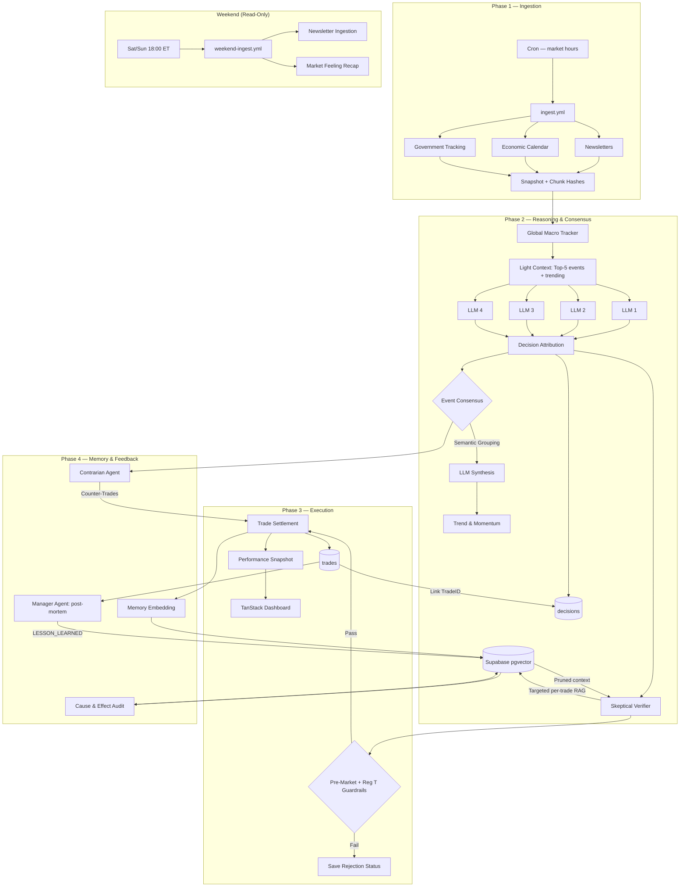

# Project Overview

Automated platform where multiple LLMs compete in a virtual stock market. Multiple times daily during market hours, they parse financial newsletters, debate events, and rebalance portfolios — with meta-agents reviewing consensus afterward.

## Repo Map

```
llm-market-bench/
├── apps/
│   ├── engine/              # Python data engine (pipeline, analysis, execution)
│   └── web/                 # TanStack Start dashboard (React + TypeScript)
├── packages/
│   ├── config/              # Shared config (models.json)
│   ├── database/            # Generated Supabase types
│   └── ui-design-system/    # Shared UI primitives + theme tokens
├── supabase/                # SQL migrations, RLS, type generation
└── docs/                    # Documentation (this directory)
```

**Config**: Model names live in `packages/config/models.json`. Env vars in `.env.example` files per app.

## Pipeline

Cron-triggered by GitHub Actions during US market hours — see `.github/workflows/ingest.yml` for the exact schedule. [engine/data-flow.md](./engine/data-flow.md) walks through the full pipeline.



### Ingestion
- Newsletter scraping → ad removal via a lightweight model
- Economic calendar fetch (source and cadence: see `ingest/calendar.py`)
- Government policy tracking (cadence: see `ingest/government.py`)

### Analysis
- Parallel LLM analysis via PromptFactory with modular provider handlers
- **Pre-Injected Market Data**: System pre-fetches current prices for relevant tickers (portfolio holdings + `$SYMB` in chunks + major indices) and injects them as VERIFIED MARKET DATA directly into prompts. LLMs never produce price fields — eliminating price hallucination at the source.
- **Tiered context injection**: Analysis agents receive light context (high-importance events + trending concepts). The Skeptical Verifier receives targeted per-trade RAG context (ranked by importance × similarity, scoped to the same agent's past decisions to avoid cross-contamination). All RAG output is HTML-sanitized before prompt injection.
- Batch strategy (size: see `BATCH_SIZE` in `analyze.py`) to avoid output truncation
- Active tool loop: `get_stock_quote` (optional fallback), `calculate_buy/sell_quantity`, `web_search`, `run_stock_screener`
- DiscoveryAgent identifies investable assets via stock screener tool-calling
- Global Macro Tracker provides regime awareness (σ-based "Risk-On / Risk-Off" detection)

### Consensus
- Semantic grouping (pgvector cosine similarity) → weighted consensus → event promotion
- Alpha discovery (automatic asset mapping for promoted events)
- Trend analysis (momentum scoring, PCA visualization)

### Validation & Execution
- Pre-market validation (ticker existence, liquidity floor)
- 4-layer tool enforcement system (see [TOOL_ENFORCEMENT.md](./engine/TOOL_ENFORCEMENT.md))
- Reg T margin validation (see [account-buying-power-reg-t4-calculations.md](./engine/account-buying-power-reg-t4-calculations.md))
- Atomic "Commit at the End" settlement pattern
- Two-phase attribution locking (Decision ↔ Trade)

### Feedback
- Manager Agent: multi-horizon post-mortem → `LESSON_LEARNED` memories
- Contrarian Agent: identifies crowded trades
- Cause & Effect: periodic audit of predicted vs actual impact
- Market Feeling: LLM-driven daily sentiment

### Frontend
TanStack Start + TanStack Query dashboard at [benchify.netlify.app](https://benchify.netlify.app). See [web/README.md](./web/README.md).

## Deployment

Deployed as a serverless TanStack Start app on Netlify (project `benchify`).

```bash
cd apps/web
pnpm run build
npx netlify deploy --prod
```

See [web/tanstack-start-deploy-official.md](./web/tanstack-start-deploy-official.md) for full deployment notes.

## CI/CD

- **Daily pipeline**: `.github/workflows/ingest.yml` — weekday trading runs.
- **Weekend pipeline**: `.github/workflows/weekend-ingest.yml` — ingestion + market feeling only, no trading.
- **DB backup**: `.github/workflows/db-backup.yml` — gzips a Postgres dump to a workflow artifact. Restore: `gunzip … | psql <connection_string>`.

Each workflow lists its own required secrets and schedule — read the YAML rather than duplicating here. Model names live in [`packages/config/models.json`](../packages/config/models.json) (not env vars).

## Deprecated Portfolios

When a provider's model is upgraded, the old portfolio row in the `portfolios` table is **not** automatically removed — it becomes an inactive historical record. Historical performance (trades, ledger snapshots) is preserved for auditability; no new decisions are written to these `owner_id`s.

The active set lives in [`packages/config/models.json`](../packages/config/models.json); the frontend filters retired portfolios by checking each `owner_id` against that file. Retired `owner_id`s remain in the database as historical records.

## Documentation Index

### Core
- [database-schema.md](./database-schema.md) — Supabase schema (auto-generated)

### Engine
- [data-flow.md](./engine/data-flow.md) — Complete pipeline walkthrough
- [TOOL_ENFORCEMENT.md](./engine/TOOL_ENFORCEMENT.md) — 4-layer hallucination prevention
- [WEB_SEARCH.md](./engine/WEB_SEARCH.md) — Web search configuration
- [CORRELATION_MATRIX.md](./engine/CORRELATION_MATRIX.md) — Uncorrelated asset discovery
- [agent-specific-semantic-overlap.md](./engine/agent-specific-semantic-overlap.md) — Per-agent redundancy
- [PNL-CALCULATIONS.md](./engine/PNL-CALCULATIONS.md) — Weighted-average cost basis
- [account-buying-power-reg-t4-calculations.md](./engine/account-buying-power-reg-t4-calculations.md) — Margin formulas
- [market-heuristics.md](./engine/market-heuristics.md) — Trading principles
- [testing.md](./engine/testing.md) — Test infrastructure + reasoning trace audit

### Web
- [web/README.md](./web/README.md) — Architecture & feature slicing
- [web/TANSTACK_BEST_PRACTICES.md](./web/TANSTACK_BEST_PRACTICES.md) — Query patterns
- [web/DESIGN_SYSTEM.md](./web/DESIGN_SYSTEM.md) — Visual language
- [web/testing.md](./web/testing.md) — Frontend tests
- [web/portfolios-ui.md](./web/portfolios-ui.md) — Portfolio UI behavior
- [web/tanstack-start-deploy-official.md](./web/tanstack-start-deploy-official.md) — Deployment

### Reference
- [reference/government-incentive-quick-ref.md](./reference/government-incentive-quick-ref.md) — Policy tracking
- [reference/anomaly-detector-design.md](./reference/anomaly-detector-design.md) — Automated code auditor

## External References
- FMP API: [https://site.financialmodelingprep.com/developer/docs](https://site.financialmodelingprep.com/developer/docs)
- Claude web search: [https://docs.anthropic.com/en/docs/build-with-claude/tool-use/web-search](https://docs.anthropic.com/en/docs/build-with-claude/tool-use/web-search)
- Gemini grounding: [https://ai.google.dev/gemini-api/docs/grounding](https://ai.google.dev/gemini-api/docs/grounding)
- OpenAI web search: [https://platform.openai.com/docs/guides/tools-web-search](https://platform.openai.com/docs/guides/tools-web-search)
- TanStack Start hosting: [https://tanstack.com/start/latest/docs/framework/react/hosting](https://tanstack.com/start/latest/docs/framework/react/hosting)
