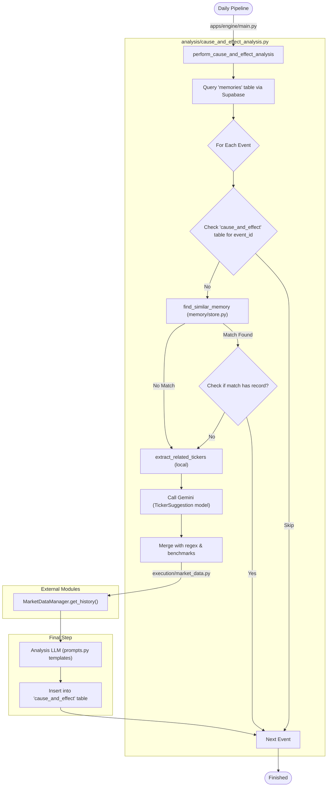

# Cause & Effect Analysis: Predicted vs Actual Impact

The Cause & Effect analysis is a bi-weekly pipeline (Tuesdays & Fridays) that audits past market events to track how accurately they were predicted and what their actual ripple effects were across specific sectors and companies.

## Technical Architecture

The following diagram maps the logical flow to specific functions and files in the codebase.



## Key Features

### 1. Semantic Deduplication
To prevent redundant analysis of similar narratives (e.g., repeating a "Fed Rate Hike" analysis twice), the engine uses pgvector similarity search.
- **Function**: `find_similar_memory` in `apps/engine/memory/store.py`.
- **Logic**: If an event has a similarity score > 0.85 with a previously analyzed memory within the last 7 days, it is skipped. This captures 'really similar' events that might be slightly reworded.

### 2. Dynamic Ticker Discovery
Instead of a hardcoded mapping, the engine dynamically identifies relevant stock tickers and sector ETFs for every event.
- **Function**: `extract_related_tickers` in `apps/engine/analysis/cause_and_effect_analysis.py`.
- **Model**: Uses Gemini Flash with the `TickerSuggestion` Pydantic model.
- **Capabilities**: **Prioritizes individual companies**, suppliers, or competitors directly affected by the news. It only falls back to broad sector ETFs (e.g., XLK) if no specific company-level impact is found.

### 3. Historical Data Context
The engine pulls historical price data for all discovered tickers from the `MarketDataManager` to provide the LLM with concrete evidence of the event's impact.
- **Benchmarks**: `SPY` and `QQQ` are included as a secondary baseline for comparison if room exists in the top 5 tickers.

## How to Run
The Cause & Effect analysis is part of the main entry point:
```bash
python main.py
```
It only executes on the scheduled days (Tuesdays and Fridays) as defined in the `perform_cause_and_effect_analysis()` entry condition.

## Manual Verification
You can use the test suite to verify the deduplication and discovery logic:
```bash
pytest apps/engine/tests/test_cause_and_effect_dedupe.py
```
