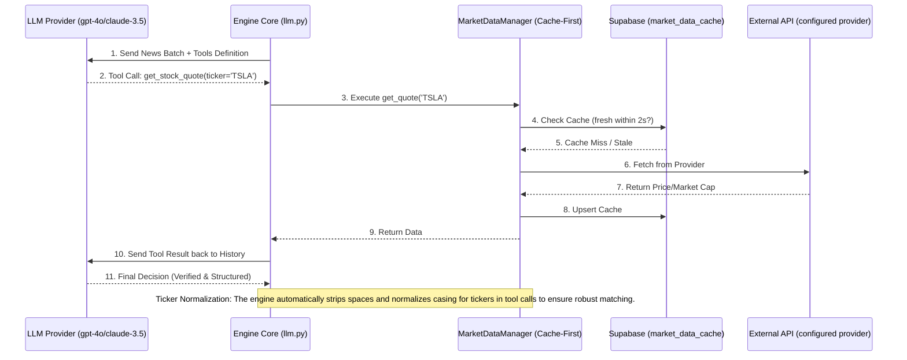
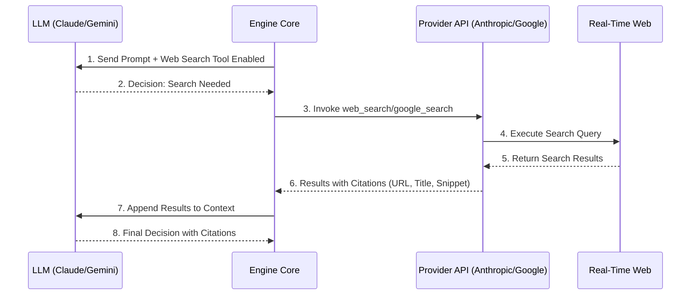

# Data Flow: Newsletter Ingestion to Trading Decisions

This document provides a detailed step-by-step walkthrough of the complete data pipeline, from fetching newsletters via Gmail to generating LLM-based trading decisions and storing them with full attribution.

## Overview

The pipeline has six main phases:

1. **Ingestion**: Fetch newsletters from Gmail, identify macro catalysts from the Economic Calendar, clean them, and generate unique identifiers
2. **Context Retrieval**: Embed queries and retrieve historical context from vector store
3. **LLM Analysis**: Send enriched prompts to 4 LLM providers in parallel
4. **Attribution & Consensus**: Save decisions with traceability, determine global market events, and invoke Alpha Discovery Agent to map events to investable assets
5. **Validation & Execution**: Enforce guardrails and reconcile trades in the ledger
6. **Reinforcement**: Perform post-analysis on past trades to improve future reasoning

---

## Example: Processing 4 Newsletters

### Input Data

```
Newsletter 1: "TSLA Rally Expected" (500 chars)
Newsletter 2: "Fed Rate Hike Impact" (300 chars)
Newsletter 3: "AI Boom Analysis" (450 chars)
Newsletter 4: "Crypto Crash Warning" (250 chars)
```

---

## Phase 1: Ingestion (Gmail → Supabase)

### Step 1.1: Fetch Message List from Gmail

**File**: `apps/engine/ingest/newsletter.py` → `ingest_newsletters()`

```python
# Gmail API Call #1
results = service.users().messages().list(
    userId="me",
    q="from:(newsletter1@example.com OR newsletter2@example.com OR ...)",
    newer_than:1d,
    maxResults=20
).execute()

# Returns: 4 message IDs
# [msg_id_001, msg_id_002, msg_id_003, msg_id_004]
```

**API Usage**: 1 Gmail API call to list all unread newsletters

---

### Step 1.2: Fetch and Process Each Message

**File**: `apps/engine/ingest/newsletter.py` → `_process_message()`

```
For each of the 4 message IDs:

Gmail API Call #2 (msg_id_001):
  service.users().messages().get(
    userId="me",
    id="msg_id_001",
    format="full"
  ).execute()

  Returns: Full email payload including headers and body

Message 1 Structure:
  ├─ From: newsletter1@example.com
  ├─ Date: 2024-12-25T10:00:00Z
  ├─ Subject: "TSLA Rally Expected"
  └─ Content (base64url encoded):
      <html>Tesla stock expected to rally...
      ...with 500 character HTML content...</html>

Processing Steps:
  1. Extract headers (From, Date, Subject)
  2. Parse email body with extract_email_body()
  3. Decode base64url (decode_base64_url)
  4. Parse HTML with BeautifulSoup
  5. Clean text (remove non-ASCII, normalize whitespace)
  6. **LLM De-advertisement**: Pass text to Gemini Flash to remove sponsored subsections.

  Result: "Tesla stock expected to rally due to..."
```

**API Usage**: 4 Gmail API calls (one per message)

**Code Flow**:
- `_process_message()` extracts headers, parses email body
- `extract_email_body()` handles base64 decoding and HTML parsing
- `clean_text()` normalizes the intermediate output
- **Advertisement Removal**: `clean_newsletter_content()` (Gemini API) filters out non-financial commercial content.
- **Semantic Monitoring**: `ingest_newsletters()` tracks the yield per configured sender. If a sender produces 0 vignettes while others succeed, a `SEMANTIC FRAGILITY ALERT` is logged.

---

### Step 1.3: Generate Unique Identifiers

**File**: `apps/engine/ingest/newsletter.py` → `generate_source_id()`, `generate_chunk_hash()`

For each newsletter, generate two identifiers:

#### Source ID (Deterministic Hash)

```python
def generate_source_id(date_str, sender, subject):
    """
    Combines date, sender, and subject to create unique identifier.
    Deterministic: same email always produces same source_id.
    """
    sender_clean = re.sub(r"[^a-zA-Z0-9]", "_",
                          sender.split("<")[-1].split(">")[0])
    combined = f"{date_str}_{sender}_{subject}"
    h = hashlib.md5(combined.encode()).hexdigest()[:8]
    return f"news_{sender_clean}_{h}"

# For Newsletter 1:
# Input: date="2024-12-25T10:00:00Z",
#        sender="newsletter1@example.com",
#        subject="TSLA Rally Expected"
# Output: source_id = "news_newsletter1_a7f92c4e"
```

#### Content Hash (SHA-256 Deduplication)

```python
def generate_chunk_hash(content):
    """
    SHA-256 hash of content for deduplication.
    Different content = different hash.
    """
    return hashlib.sha256(content.encode()).hexdigest()

# For Newsletter 1 content: "Tesla stock expected to rally..."
# Output: chunk_hash = "2e4ff8b5a3c2d1e9f7a4b6c8d0e1f2a3..." (64 chars)
```

**Results for all 4 newsletters**:

```
Newsletter 1:
├─ source_id: "news_newsletter1_a7f92c4e"
├─ chunk_hash: "2e4ff8b..."
├─ sender: "newsletter1@example.com"
├─ subject: "TSLA Rally Expected"
├─ date: "2024-12-25T10:00:00Z"
├─ content: "Tesla stock expected to rally due to..."
└─ ingested_at: "2024-12-26T08:30:00Z"

Newsletter 2:
├─ source_id: "news_newsletter2_b1d83f7a"
├─ chunk_hash: "5a3c21d..."
└─ ...

Newsletter 3:
├─ source_id: "news_newsletter3_c9e17b3f"
├─ chunk_hash: "7f8e91a..."
└─ ...

Newsletter 4:
├─ source_id: "news_newsletter4_d4a2c85b"
├─ chunk_hash: "3b6d45c..."
└─ ...
```

---

### Step 1.4: Save to Supabase (newsletter_snapshots table)

**File**: `apps/engine/main.py` → `run_ingest()` (upsert loop)

```python
# Database Insert #1-4 (one per newsletter)
for item in data:  # data contains 4 newsletter dicts
    upsert_newsletter_snapshot(sb_client, item)
```

**Database Schema**: `supabase/migrations/20231221000000_create_newsletters_table.sql`

```sql
CREATE TABLE newsletter_snapshots (
    id UUID PRIMARY KEY DEFAULT uuid_generate_v4(),
    source_id TEXT NOT NULL,           -- "news_newsletter1_a7f92c4e"
    chunk_hash TEXT NOT NULL,          -- "2e4ff8b..."
    sender TEXT,                       -- "newsletter1@example.com"
    subject TEXT,                      -- "TSLA Rally Expected"
    content TEXT,                      -- "Tesla stock expected..."
    date TIMESTAMP,                    -- "2024-12-25T10:00:00Z"
    ingested_at TIMESTAMP             -- "2024-12-26T08:30:00Z"
);
```

**Result in Database**:

```
newsletter_snapshots table after Phase 1:
┌────────────────────────┬──────────────────┬────────────────────────┐
│ source_id              │ content (first 50 chars) │ chunk_hash     │
├────────────────────────┼──────────────────┼────────────────────────┤
│ news_newsletter1_a7... │ Tesla stock exp... │ 2e4ff8b...             │
│ news_newsletter2_b1... │ Fed rate hike ma... │ 5a3c21d...             │
│ news_newsletter3_c9... │ AI boom creating...  │ 7f8e91a...             │
│ news_newsletter4_d4... │ Crypto market cra...  │ 3b6d45c...             │
└────────────────────────┴──────────────────┴────────────────────────┘
```

**Phase 1 Summary**:
- 5 Gmail API calls (1 list + 4 get)
- 4 database inserts
- 4 unique source_ids generated
- 4 unique chunk_hashes generated

---

## Phase 1.5: Economic Calendar Ingestion (Trading Economics → Supabase)

**File**: `apps/engine/ingest/calendar.py` → `run_calendar_pipeline()`

Twice a week (Sundays and Wednesdays), the engine fetches the global macro calendar to identify high-signal catalysts independently of news providers.

### Step 1.5.1: Fetch and Parse Calendar
1. **Fetch**: Uses `curl -L` to pull the latest calendar HTML from Trading Economics.
2. **Parse**: `CalendarPipeline.parse_events()` uses BeautifulSoup to extract structured event data.
3. **Analyze**: High-importance events (Importance >= 8) are identified by DeepSeek and formatted as `MacroEvent` objects.

### Step 1.5.2: Store as Catalyst Memories
1. **Deduplication**: Checks `memories` for existing events (Similarity > 0.90) to avoid duplicates.
2. **Insertion**: Saves as `CALENDAR_EVENT` memories with `target_date` for Horizon Watch.
3. **Catalyst Marking**: Explicitly sets `is_future_catalyst = true` and `event_time` (e.g., "10:00 AM") in metadata to ensure promotion to the dashboard's Horizon Watch section.

---

## Phase 1.6: Global Macro Tracking (Market Regime Detection)

**File**: `apps/engine/core/macro_tracker.py` → `get_global_macro_context()`

Immediately before the parallel analysis starts, the engine fetches a real-time snapshot of the global macro environment to give the LLMs "regime awareness."

### Step 1.7.1: Multi-Category Asset Fetching
The tracker fetches current quotes for 16 key assets across four categories:
1. **Equities**: SPY, QQQ, DIA, IWM (US Indices)
2. **International**: EWJ, EWY, VGK, MCHI, EEM (Japan, Korea, Europe, China, Emerging)
3. **Commodities**: GLD, SLV, CPER, USO (Gold, Silver, Copper, Oil)
4. **Yields & Indices**: IEF (10-Yr Treasury), UUP (Dollar), VIXY (Volatility)

### Step 1.7.2: Volatility & Regime Analysis
For each ticker, the engine:
1. Fetches **30 days of historical data**.
2. Calculates the **daily percentage change** (current price vs. previous close).
3. Computes the **historical standard deviation ($\sigma$)**.
4. Assigns a **Regime Flag**:
    - `Normal`: Change within $1.5\sigma$.
    - `❗ UNUSUAL`: Change exceeds $1.5\sigma$.
    - `⚠️ HIGHLY UNUSUAL (Regime Shift)`: Change exceeds $2.0\sigma$.

**Output**: A formatted text block injected into the LLM prompt, e.g.:
`US Dollar Index (DXY): 104.20 [+1.80% today] | ⚠️ HIGHLY UNUSUAL (Regime Shift) (30d stdev: 0.75%)`

---

## Phase 2: Filtering & Context Retrieval

### Step 2.1: Filter Malformed Chunks & Initialize Portfolios

**File**: `apps/engine/analyze.py` → `analyze_chunks()`

Before analysis, the engine performs the following setup:
1. **Filtering**: Validates all chunks to ensure they possess both a `source_id` and `content`.
2. **Portfolio Initialization**: Initializes the `Portfolio` for every model in the pipeline.
3. **Parallel Price Fetching**: Collects all unique tickers held across these portfolios and fetches their current market prices in parallel via `MarketDataManager`.
4. **Context Aggregation**: Aggregates historical context (including government incentives and lessons learned) via parallel vector searches using a single set of embeddings.

```python
valid_chunks = [
    c for c in chunks 
    if c.get("source_id") and c.get("content")
]
```

### Step 2.2: Extract Query Texts

**File**: `apps/engine/analyze.py` → `analyze_chunks()` (Returns `decisions, events, aggregated_context`)

From the 4 stored newsletters, use the full content of each as queries for embedding:

```python
queries = [
    chunk.get("content", "") for chunk in chunks
    if chunk.get("content")
]

# Result:
# [
#   "Tesla stock expected to rally due to strong earnings momentum and positive sentiment across the sector. Multiple analysts predict continued upward movement through Q1 2025...",  # Query 1 (full content)
#   "Fed rate hike may trigger market volatility affecting tech stocks and growth companies. Historical precedent shows 2-3 week correction periods following policy announcements...",         # Query 2 (full content)
#   "AI boom creating unprecedented demand for semiconductor chips. NVIDIA reporting record order backlogs with 12-month lead times...",                              # Query 3 (full content)
#   "Crypto market crash warning signs emerging. Technical indicators suggest potential 30-40% correction in major cryptocurrencies..."                                           # Query 4 (full content)
# ]
```

**Why full content instead of truncated?**
- More semantic information for embeddings
- Better vector similarity matching with historical context
- Improved RAG context retrieval quality

---

### Step 2.2: BATCH Embed All Queries (Single API Call)

**File**: `apps/engine/memory/embeddings.py` → `get_embeddings_batch()`

This is the KEY OPTIMIZATION: all 4 queries embedded in ONE API call, not 4 separate calls.

```python
# Gemini Embedding API Call #1 (SINGLE CALL for all 4 queries)
response = client.models.embed_content(
    model="gemini-embedding-001",  # 768-dimensional embeddings
    contents=[
        "Tesla stock expected to rally due to strong earnings...",      # Query 1
        "Fed rate hike may trigger market volatility...",              # Query 2
        "AI boom creating unprecedented demand...",                     # Query 3
        "Crypto market crash warning signs emerging..."                # Query 4
    ]
)

# Returns: 4 embedding vectors, each with 768 dimensions
embeddings = [
    [0.234, -0.561, 0.891, ..., 0.123],    # Embedding 1 (768 floats)
    [0.102, 0.445, -0.234, ..., 0.456],    # Embedding 2 (768 floats)
    [-0.456, 0.789, 0.123, ..., -0.789],   # Embedding 3 (768 floats)
    [0.678, -0.234, -0.456, ..., 0.234]    # Embedding 4 (768 floats)
]
```

**Why batch embeddings?**
- 1 API call instead of 4 → lower latency
- Cost efficient → bulk discount
- Still provides individual embeddings for each query

---

### Step 2.3: Query Vector Store (Retrieve Historical Context)

**File**: `apps/engine/memory/store.py` → `retrieve_context_batch()`

For each of the 4 embeddings, perform a vector similarity search:

**Database Schema**: `supabase/migrations/20231224000000_enable_pgvector_and_memories.sql`

```sql
CREATE TABLE memories (
    id UUID PRIMARY KEY DEFAULT uuid_generate_v4(),
    content TEXT NOT NULL,
    embedding VECTOR(768),        -- 768-dim Gemini embeddings
    metadata JSONB,
    created_at TIMESTAMPTZ
);

-- HNSW Index for fast similarity search
CREATE INDEX memories_embedding_idx ON memories
    USING hnsw (embedding vector_cosine_ops);

-- RPC Function for vector similarity search
CREATE FUNCTION match_memories(
    query_embedding VECTOR(768),
    match_threshold FLOAT,
    match_count INT
) RETURNS TABLE (id UUID, content TEXT, metadata JSONB, similarity FLOAT) AS ...
```

**Supabase RPC Calls #1-4**:

```python
# For Embedding 1
response = client.rpc(
    "match_memories",
    {
        "query_embedding": [0.234, -0.561, 0.891, ...],  # Embedding 1
        "match_threshold": 0.5,                           # Min cosine similarity
        "match_count": 3                                  # Return top 3
    }
).execute()

# Returns: Top 3 similar memories with cosine similarity > 0.5
response.data = [
    {
        "id": "uuid1",
        "content": "Past Tesla analysis from 3 months ago demonstrated...",
        "metadata": {"source": "Tesla earnings report"},
        "similarity": 0.87
    },
    {
        "id": "uuid2",
        "content": "Bull market signal observation from previous quarter...",
        "metadata": {"source": "Technical analysis"},
        "similarity": 0.72
    },
    {
        "id": "uuid3",
        "content": "Tech rally momentum study showing positive indicators...",
        "metadata": {"source": "Market analysis"},
        "similarity": 0.65
    }
]

# For Embedding 2
response = client.rpc(...)
# Returns: Top similar memories about Fed rate hikes
# [
#   {"content": "Previous rate hike aftermath data shows...", "similarity": 0.81},
#   {"content": "Market volatility patterns during FOMC meetings...", "similarity": 0.68}
# ]

# For Embedding 3
response = client.rpc(...)
# Returns: Top similar memories about AI
# [
#   {"content": "AI infrastructure investments accelerating...", "similarity": 0.79}
# ]

# For Embedding 4
response = client.rpc(...)
# Returns: Top similar memories about Crypto
# [
#   {"content": "Crypto downturn predictions from technical analysis...", "similarity": 0.74}
# ]
```

---

### Step 2.4: Aggregate Retrieved Context

**File**: `apps/engine/analyze.py` → `analyze_chunks()` (Aggregates standard context + government incentives + lessons learned)

Combine all retrieved context into a single string:

```python
context_results = [
    "- Past Tesla analysis from 3 months ago demonstrated...\n- Bull market signal observation...\n- Tech rally momentum study...",
    "- Previous rate hike aftermath data shows...\n- Market volatility patterns...",
    "- AI infrastructure investments accelerating...",
    "- Crypto downturn predictions from technical analysis..."
]

aggregated_context = "\n".join([c for c in context_results if c])

# Result:
aggregated_context = """
- Past Tesla analysis from 3 months ago demonstrated...
- Bull market signal observation...
- Tech rally momentum study...
- Previous rate hike aftermath data shows...
- Market volatility patterns during FOMC meetings...
- AI infrastructure investments accelerating...
- Crypto downturn predictions from technical analysis...
"""
```

**Phase 2 Summary**:
- 1 Gemini Embedding API call (batch for all 4 queries)
- 4 Supabase RPC calls (vector similarity search)
- **Step 5.4: Calendar Context Injection**: For each model task, the engine calculates the **`current_day_info`** (Today's date, Day of Week, and proximity to month boundaries or holidays). This is injected into the prompt along with the **`CALENDAR_STRATEGY_KNOWLEDGE`** (Turn of the Month, Payday Anomaly, etc.) to enable seasonal anomaly reasoning. The engine also enforces a **Market Hours Guardrail** (09:30-16:00 ET, Mon-Fri) for all ingestion runs. The guardrail uses **FMP API with class-level caching (5-minute TTL)** to check market status only once per pipeline run, reducing redundant API calls while maintaining holiday awareness.
- Aggregated historical context (Standard + Gov + Lessons) ready for LLM analysis.
- Context labeled with **`[PAST REASONING (HISTORICAL)]`** to distinguish from current holdings.

---

## Phase 3: LLM Analysis (Active Tool Loop)

### Step 3.0: Asynchronous Chunk Batching
**File**: `apps/engine/analyze.py` → `analyze_chunks()`

To ensure high reasoning quality and avoid output token limits (16k), the engine splits the `valid_chunks` into smaller batches:
1.  **Batch Size**: 20 chunks per LLM call.
2.  **Async Parallelism**: Each batch is dispatched as a separate `asyncio` task per provider.
3.  **Result Aggregation**: The engine tracks `task_configs` to map the results of these parallel batches back to the correct model attribution.

### Step 3.1: Build Enriched Prompt

**File**: `apps/engine/core/llm/`

```python
prompt = f"""You are a hedge fund trading algorithm.
CRITICAL: Use the `get_stock_quote` tool for ANY ticker you intend to BUY or SELL.
This confirms the ticker exists, is liquid (Market Cap > $2B), and provides the current market price.
Use `calculate_sell_quantity(ticker, percentage)` to calculate exact share quantities for selling positions. (MANDATORY for all SELLs; hard-enforced by the engine).

WEB SEARCH CAPABILITY: You have access to real-time web search via the `web_search` tool.
Use it to verify breaking news, check corporate actions (earnings, splits, M&A), confirm government policy announcements, and fact-check claims before trading.
When you use web search, cite the sources in your reasoning.

=== ENHANCED PORTFOLIO CONTEXT (2026-03-24) ===
The prompt now includes:
1. **Source of Truth Portfolio Section**: Clearly marked as the ONLY authoritative list of holdings
2. **Held Tickers Quick Reference**: Explicit list of tickers available for SELL (e.g., "You currently hold: NVDA, TSLA, AAPL")
3. **Ownership Warnings**: Bold warnings that SELL signals for unheld tickers will be REJECTED

### Historical Context:
{aggregated_context}

### News Batch:
---
Source ID: news_newsletter1_a7f92c4e
Content: Tesla stock expected to rally due to...
---
...
"""
```

### **Pre-Analysis Portfolio Validation**

After LLM analysis completes but before decisions are returned, the engine performs ownership validation:

```python
# Extract held tickers from portfolio context
held_tickers = _extract_held_tickers(portfolio_context)

# Filter SELL decisions for unheld tickers
for decision in decisions:
    if decision.signal == "SELL" and decision.ticker not in held_tickers:
        # Convert to HOLD with rejection reasoning (preserves audit trail)
        decision.signal = "HOLD"
        decision.reasoning = f"REJECTED_OWNERSHIP: Attempted to sell {decision.ticker} but ticker is not held"
```

**Impact**: Catches ownership hallucinations before they reach the verification layer, reducing rejected trades and preserving clean audit trails.

### Step 3.2: Parallel Multi-Step Tool Execution

**File**: `apps/engine/core/llm/handlers/`

Each LLM provider is processed via a **dedicated handler** to manage provider-specific quirks:
- **`openai.py`**: Standard tool loop for GPT-4o, gpt-5.4-nano.
- **`deepseek.py`**: Preserves `reasoning_content` in assistants' messages when tool calls are present (required by DeepSeek) and enables thinking mode.
- **`anthropic.py`**: Handles XML-like tool blocks and web search.
- **`gemini.py`**: Manages native Google Search grounding.



### Step 3.2a: Web Search Tool Execution (Optional)

**File**: `apps/engine/core/llm/handlers/anthropic.py`, `gemini.py`

For **Anthropic Claude** and **Google Gemini**, agents can invoke native web search tools during the tool loop:



**Provider-Specific Implementation:**

| Provider | Tool Name | Response Format | Citations | Requirements |
|----------|-----------|-----------------|-----------|--------------|
| **Anthropic** | `web_search_20250305` | Server-side execution, results in response text | ✅ `cited_text`, `url`, `title` | Any Claude model (Haiku 4.5+) |
| **Gemini** | `google_search` | `groundingMetadata` | ✅ `groundingChunks`, `groundingSupports` | Any Gemini 2.5+/3.x model |
| **OpenAI** | `web_search` | `web_search_call` + annotations | ✅ `url_citation` | **Search-enabled model** (`gpt-5-search-api`, `gpt-4o-search-preview`) or Responses API |

**Server Tool Behavior (Anthropic):**

Anthropic's web search is a **server tool** - it executes entirely on Anthropic's servers. The handler:
- Does **NOT** execute anything client-side
- Does **NOT** send `tool_result` blocks back
- Does **NOT** record `server_tool_use` in message history (internal to Anthropic)
- Receives search results automatically incorporated into response text with citations

See [WEB_SEARCH.md](./WEB_SEARCH.md) for detailed implementation.

**Configuration:**
```bash
ENABLE_ANTHROPIC_WEB_SEARCH=true      # Enable for Claude
ENABLE_GEMINI_WEB_SEARCH=true         # Enable for Gemini
ANTHROPIC_WEB_SEARCH_VERSION="web_search_20250305"  # ZDR-compliant version
ANTHROPIC_MAX_WEB_SEARCHES=3          # Limit searches per request
```

**Use Cases:**
- Verifying breaking news mentioned in newsletters
- Checking corporate actions (earnings dates, M&A announcements, stock splits)
- Confirming government policy announcements (budget allocations, regulatory changes)
- Fact-checking claims before executing trades

**Cost Control:**
- Web searches are **disabled by default** in the verification pipeline (focused validation)
- `ANTHROPIC_MAX_WEB_SEARCHES` limits searches per request
- Agents are prompted to use search strategically, not for every query

### Step 3.3: Structured Extraction (Instructor)

**File**: `apps/engine/core/llm/`

After the tool loop finishes, the engine performs one final pass to ensure the output perfectly matches the Pydantic `DecisionsResponse` schema.

```python
valid_decisions = [
    DecisionObject(
        signal="BUY",
        confidence=85,
        reasoning="Verified price is reasonable ($240.50).",
        ticker="TSLA",
        catalyst_type="EARNINGS",
        catalyst_duration="SHORT_TERM",
        source_id="news_newsletter1_a7f92c4e",
        price=240.50, # Automatically filled from Tool Result OR Backfilled by Engine
        model_provider="openai",
        model_name="gpt-4o"
    ),
    ...
]

# NEW: Hard Tool Enforcement (in analyze.py)
# After the tool loop, the engine scans the actual conversation history.
# It confirms that required tools (get_stock_quote for all, sell_X_percent for SELL) were actually executed via native function calling.
# If an agent claims tool usage in text but it's not a formal tool call in history, the trade is rejected.

# NEW: Price Backfill Logic (in analyze.py)
# If decision.price is missing/null, engine queries MarketDataManager to backfill real-time price.
```

**Phase 3 Summary**:
- **Active Reasoning**: Models verify data *before* committing to a decision.
- **Unified Tool Interface**: Handle OpenAI, Anthropic, and Gemini tool schemas in one loop.
- **Cache Integration**: Real-time tools hit the `market_data_cache` first to keep the UI fast.

---

## Phase 3.5: Pre-Market Validation (Cache-First Core)

### Step 3.4: Verify Against Real-Market Data

**File**: `apps/engine/execution/market_data.py`

This layer ensures that every ticker is liquid and real. It is utilized both as a **Tool** by LLMs and as a **Final Post-Gauntlet** by the engine.

#### Cache-First Logic:
1.  **Check Persistence**: Query `market_data_cache` in Supabase.
2.  **TTL Verification**: If `fetched_at` is older than 2 seconds (configurable), proceed to fetch.
3.  **External Fetch**: Hit the configured provider via the `FinancialProvider` interface.
4.  **NaN Filtering**: Explicitly reject `NaN` values for price and market cap using `math.isnan()`.
5.  **Batch Upsert & Teardown**: The engine uses **Batch Upserts** to save historical price data to Supabase in a single call. Then, it invokes `disconnect_all()` via the provider class to release any persistent resources.

#### The Three Guardrails:

| Guardrail | Logic | Goal |
| --- | --- | --- |
| **A: Existence** | `if not data or not data.exists` | Reject non-existent/delisted tickers. |
| **B: Price Banding** | `if abs(ai_price - market_price) / market_price > 0.01` | Reject hallucinated prices (>1% deviation). |
| **C: Liquidity** | `if market_cap < 2_000_000_000` | Reject "Penny Stocks" (Market Cap < $2B). |
| **D: Buying Power** | `if cost > buying_power` | Reject trades exceeding margin limits. |
| E: Minimum Value | `Trade Cost > $1,000` | Mandatory for BUYS; waived for SELLS if a sell tool is used. |
| **F: SMA Floor** | `if projected_sma < 10% equity` | Reject trades risking Reg T compliance. |

**Validation Result**:
```json
{
  "ticker": "TSLA",
  "status": "PASSED",
  "market_price": 240.50,
  "market_cap": 750000000000.0,
  "cached": true
}
```

**Phase 3.5 Summary**:
- **Efficiency**: Reduces external API calls by $>90%$ for repeated tickers.
- **Safety**: Prevents portfolio contamination from illiquid or fake tickers.
- **Persistence**: Centralized market data source for both Python Engine and Frontend.

---

## Phase 4: Save Decisions with Attribution

### Step 4.1: Save Each Decision

**File**: `apps/engine/main.py` → `run_ingest()` (decision save loop)

```python
saved_decisions = 0
for d in valid_decisions:  # Iterate through 10-15 decisions
    try:
        save_decision(sb_client, d)
        saved_decisions += 1
        logger.info(
            f"[{d.ticker}] {d.signal} (Conf: {d.confidence}%): "
            f"Saved attribution for {d.model_provider}/{d.model_name}"
        )
    except Exception as e:
        logger.error(f"Failed to save decision for {d.ticker}: {e}")
```

**Attribution Service**: `apps/engine/attribution/service.py`

```python
def save_decision(client: Client, decision: DecisionObject) -> dict:
    """Save decision with complete attribution trail."""
    payload = {
        "source_id": decision.source_id,          # Links back to newsletter
        "ticker": decision.ticker,
        "signal": decision.signal,
        "confidence": decision.confidence,
        "reasoning": decision.reasoning,          # LLM explanation
        "model_provider": decision.model_provider,
        "model_name": decision.model_name
    }

    # Database Insert #5-16 (one per decision)
    client.table("decisions").insert(payload).execute()
```

---

### Step 4.2: Final State of Database

**Database Schema**: Decisions table

```sql
CREATE TABLE decisions (
    id UUID PRIMARY KEY DEFAULT uuid_generate_v4(),
    source_id TEXT NOT NULL,           -- Links to newsletter_snapshots
    ticker TEXT NOT NULL,              -- "TSLA", "SPY", "NVDA", etc.
    signal TEXT NOT NULL,              -- "BUY", "SELL", "HOLD"
    confidence INTEGER,                -- 0-100
    reasoning TEXT,                    -- Full LLM explanation
    model_provider TEXT,               -- "openai", "anthropic", "gemini", "deepseek"
    model_name TEXT,                   -- "gpt-5.4-nano", "claude-haiku-4-5", etc.
    created_at TIMESTAMPTZ DEFAULT now()
);
```

**Final decisions table contents**:

```
┌─────────────────────────┬────────┬────────┬─────┬────────────┬──────────┬──────────────────┐
│ source_id               │ ticker │ signal │ conf│ reasoning  │ provider │ model_name       │
├─────────────────────────┼────────┼────────┼─────┼────────────┼──────────┼──────────────────┤
│ news_newsletter1_a7f... │ TSLA   │ BUY    │ 85  │ Tesla...   │ openai   │ gpt-5.4-nano      │
│ news_newsletter1_a7f... │ TSLA   │ BUY    │ 92  │ Tesla...   │ anthropic│ claude-haiku-4-5│
│ news_newsletter2_b1d... │ SPY    │ HOLD   │ 60  │ Fed...     │ openai   │ gpt-5.4-nano      │
│ news_newsletter3_c9e... │ NVDA   │ BUY    │ 78  │ AI...      │ openai   │ gpt-5.4-nano      │
│ news_newsletter3_c9e... │ NVDA   │ BUY    │ 92  │ AI trans..│ anthropic│ claude-haiku-4-5│
│ news_newsletter4_d4a... │ BTC    │ SELL   │ 78  │ Crypto...  │ anthropic│ claude-haiku-4-5│
│ news_newsletter4_d4a... │ BTC    │ SELL   │ 82  │ Crypto...  │ gemini   │ gemini-3-flash-preview       │
│ news_newsletter2_b1d... │ QQQ    │ SELL   │ 71  │ Tech...    │ deepseek │ deepseek-reasoner    │
│ ...                     │ ...    │ ...    │ ... │ ...        │ ...      │ ...              │
└─────────────────────────┴────────┴────────┴─────┴────────────┴──────────┴──────────────────┘

Key Features:
- source_id traces each decision back to original newsletter
- Multiple decisions per ticker from different models (consensus)
- Confidence scores enable filtering/weighting
- Complete audit trail preserved
```

**Phase 4 Summary**:
- 10-15 database inserts (one per decision)
- All decisions linked to source via source_id
- Complete attribution metadata preserved
- Ready for portfolio management or reporting

---

## Phase 5: Event Consensus (Consolidating the Global Timeline)

### Step 5.1: Semantic Grouping & Deduplication

**File**: `apps/engine/consensus.py`

The LLMs also identify "Macro Events." Because different models use different words, we group them semantically rather than by strict strings.

```python
# Grouping Logic:
# Model A: "Fed Rate Hike"
# Model B: "Interest Rate Increase"
# Result: Similarity 0.94 -> SAME GROUP
```

Before promoting, the engine also checks for temporal duplicates (Step 5.1a) against the `memories` table to prevent "Redundant RAG noise."

### Step 5.2: Memory Chain & Relationship Analysis

**File**: `apps/engine/consensus.py`

For each consensus group, the engine checks for related past events.
1.  **Ancestor Search**: Vector search (Similarity > 0.4).
2.  **Relationship Analysis**: LLM categorizes as `REVERSAL`, `RESOLUTION`, or `UPDATE`.
3.  **Auto-Resolution**: Mark ancestors as `RESOLVED` if reversed.
4.  **Context Enrichment**: Enriches memory strings with `[ONGOING]` and `[Historical Parallel]` labels for better RAG retrieval.

### Step 5.3: LLM Synthesis & Future Tracking

**File**: `apps/engine/core/llm/`

For events that reach consensus (2+ models), we perform a final synthesis pass to unify naming and extract critical flags:

```json
// Synthesized Output
{
  "name": "Fed Policy Tightening",
  "summary": "Multiple models observe hawkish Fed signals...",
  "is_ongoing": true,
  "is_future_catalyst": true,
  "historical_parallel": "Like the 1970s stagflation regime",
  "future_date": "2026-07-31",
  "future_date_note": "estimated"
}
```

**Asset Discovery (How to Profit)**: Promoted consensus events automatically trigger the `DiscoveryService`. The engine maps the event's theme to sectors, industries, and keywords, then queries the Financial Modeling Prep (FMP) API to append specific, actionable investment assets (Stocks/ETFs) to the event's `scenario_analysis` metadata.

**Future Tracking (Proactive Positioning)**: If an event contains a `future_date`, it is recorded in the `memories` table with a `target_date` field for consolidated context tracking.
- **ISO 8601 Standardization**: The engine enforces `YYYY-MM-DD` format for all future dates. Vague timeframes (e.g., "by next summer") are mapped to the end of that period by the LLM. If ONLY a year is given, the date is set to `null` and the year is moved to the note.
- **Tentative Notes**: A `future_date_note` (e.g., "tentative", "estimated") is extracted and stored if the date is not exact, providing better context for Horizon Watch filtering.
- **Strict Catalyst Definition**: Events are ONLY marked as `is_future_catalyst = true` if they represent strictly pending, upcoming events with multiple possible resolutions. Ongoing structural shifts, sector rotations, and past investments are marked as `is_ongoing` to distinguish them from trade-leading catalysts.
- **Importance Threshold**: Horizon Watch strictly filters for events with `importance_score >= 8` AND `is_future_catalyst = true`, ensuring focus remains on high-leverage triggers.


---

## Phase 6: Trend & Concept Momentum Analysis

### Step 6.1: Velocity Calculation

**File**: `apps/engine/analysis/momentum.py`

The engine tracks how fast a concept is accelerating in the global discourse.

```python
# Velocity Formula
# Velocity = (Mentions in Last 24h) / (Avg Daily Mentions in Last 7 Days)
```

**Supabase RPC Call**: `match_memories_with_time`
- Used twice: once for 24h window, once for 7-day window.

### Step 6.2: Concept Merging & Decay

**File**: `apps/engine/analysis/momentum.py`

- **Merging**: New concepts are compared against existing ones in `concept_metrics`. If similarity > 0.75, they merge (increment count).
- **Decay**: Halving the velocity of concepts not mentioned in the last 28 days (Half-Life).

**Phase 6 Summary**:
- Updates `concept_metrics` table.
- Provides "Trending" signals for future dashboard use.

---

## Phase 7: Pre-Market Validation (Guardrails)

### Step 7.1: The Three Guardrails

**File**: `apps/engine/execution/validation.py`

Before any trade is executed, it must pass a strict validation layer. This runs *after* the LLM decides but *before* money moves.

| Guardrail | Check | Purpose |
| --- | --- | --- |
| **A: Existence** | `market_data.exists` | Prevent hallucinated tickers (e.g., "ABCD"). |
| **B: Price Banding** | `abs(ai_price - real_price) < 15%` | Prevent price hallucinations. |
| **C: Liquidity** | `Market Cap > $2B` | Prevent trading penny stocks. |
| **D: Buying Power** | `cost <= buying_power` | Ensure margin compliance. |
| E: Minimum Value | `Trade Cost > $1,000` | Prevent insignificant BUYS; waived for SELLS via tools. |
| **F: SMA Floor** | `Projected SMA > 10% Eq` | Safety margin for Reg T. |
| **G: Historical Backfill** | `price_history` | Uses the last known stored price when live fetch fails. |

```python
# Validation Result
{
    "ticker": "TSLA",
    "status": "PASSED",
    "market_price": 242.10,
    "market_cap": 755000000000
}
```

---

## Phase 8: Trade Execution (Sequential)

### Step 8.1: Pre-Execution Margin & Ownership Validation
The system ensures the portfolio has sufficient **Buying Power** under Regulation T rules and enforces **Portfolio Ownership** for SELL signals.

1. **Ownership Check:** If `Signal == SELL`, verify ticker is in `portfolio_positions`. Reject if not found (`REJECTED_OWNERSHIP`).
2. **Hard Tool Enforcement:** If `Signal == SELL` and the engine's history scan confirms no sell calculation tool was executed via native function calling, reject (`REJECTED_TOOL_USAGE`).
3. **Size Check (BUY):** Every purchase must be at least 10% of Buying Power or Total Equity.
4. **Buying Power Check (BUY only):** If `trade_cost > portfolio.buying_power`, reject (`REJECTED_MARGIN`).

### Step 8.2: Quantity Calculation & Settlement
The engine converts the LLM's `allocation_percentage` into a share count:
- **BUY:** Uses `Allocation % * Buying Power`. Smart Bump applies to meet the **10% Minimum** threshold if feasible.
- **Smart Bump:** If the resulting spend is < $1,000, the engine attempts to bump it to $1,000 if sufficient Buying Power exists.
- **SELL:** Uses the exact quantity calculated and returned by the sell percentage tools. (MANDATORY).
- **Fallback:** Defaults to 5% allocation for BUYS (then bumped to 10% minimum). SELLs without tool calculation are REJECTED.

If validation passes, the trade is settled into the `portfolios` table.

**Database Operations (Atomic "Commit at the End" Pattern)**:
1. **Update Positions**: `UPSERT` into `portfolio_positions` (or `DELETE` if quantity is zero).
2. **Ledger Update**: `INSERT` into `trades` table to record the execution.
3. **Commit Portfolio**: **Only after steps 1 & 2 succeed**, update `cash_balance` and `sma` in the `portfolios` table.
4. **Immediate Consistency**: Recalculate and persist complete Reg T metrics (Equity, BP, SMA) to the `portfolios` table to ensure real-time dashboard accuracy.

```sql
UPDATE portfolios 
SET cash_balance = cash_balance - 24210.00, 
    sma = sma - 13799.70 
WHERE owner_id = 'gpt-4o';
```

### Step 8.3: Real-time P&L Tracking (Dynamic View)

The system does not store P&L as a static column to avoid staleness. Instead, a SQL View calculates it on-the-fly.

**SQL View**: `position_pnl`
- **Calculation**: `(market_data_cache.price - portfolio_positions.average_cost_basis) * quantity`
- **Accessibility**: Available to the frontend and analysis engine for real-time performance tracking.

---

## Phase 9: Attribution Locking & Long-term Memory Embedding

### Step 9.1: Attribution Locking (Linking Decision to Trade)

**File**: `apps/engine/main.py` → `run_ingest()` (attribution locking), `apps/engine/attribution/service.py` → `save_decision()`

After a trade is successfully executed and a `TradeID` is generated, the engine must "lock" the attribution. This is critical for the audit trail: it ensures that we can always trace an executed trade back to the specific newsletter sentence and LLM reasoning that caused it.

**Process**:
1. `portfolio.execute_trade()` returns a UUID `trade_id`.
2. `save_decision()` is called again with the `trade_id` and status `EXECUTED`.
3. The database performs an `UPSERT` on the decision record, populating the `trade_id` foreign key.

```python
# Link Decision -> Trade
save_decision(
    sb_client, 
    d, 
    status="EXECUTED", 
    metadata=meta,
    trade_id=str(trade_id)
)
```

### Step 9.2: Long-term Memory Embedding (Reasoning)

**File**: `apps/engine/main.py` → `run_ingest()` (memory embedding), `apps/engine/memory/store.py` → `add_memory()`

The system vectorizes the *reasoning* behind the trade to create "Institutional Memory." This differs from News Ingestion (which embeds raw text) because it embeds the AI's *conclusions*.

**Process**:
1. Format reasoning: `DECISION REASONING: TSLA BUY | REASONING: Strong earnings...`
2. Call Gemini `gemini-embedding-001` to generate the vector.
3. Save to `memories` table with metadata linking to the `source_id` and `trade_id`.

**Why this matters**: In future runs, Step 2.3 (Context Retrieval) will pull this reasoning back as "Historical Context," helping the AI maintain a consistent world view.

---

## Phase 10: Performance Ledger & Equity Curve

### Step 10.1: Daily Performance Snapshot

**File**: `apps/engine/main.py` → `run_ingest()` (performance snapshot), `apps/engine/execution/portfolio.py` → `record_performance_snapshot()`

Once all trades for the day are finished, the engine calculates the daily performance metrics for every AI agent to enable the frontend "Equity Curve" visualization.

**Process**:
1. Get a list of all portfolios (OpenAI, Claude, etc.).
2. Collect all unique tickers held across all portfolios.
3. Fetch current market prices for all tickers (using `MarketDataManager` cache).
4. For each portfolio, calculate:
   - **Net Liquidation Value (NLV)**: `Cash + (Sum of Position Quantity * Market Price)`
   - **Daily P&L**: Change in NLV vs. Previous Day.
5. Create an immutable row in the `performance_snapshots` table for today's date and model.
6. **Final Update**: Persist the calculated Reg T metrics (Equity, Buying Power, Maintenance Margin, SMA) back to the main `portfolios` summary table to ensure it reflects the end-of-day state.

```python
# Record immutable snapshot
await portfolio.record_performance_snapshot(price_map)
```

**Result**: We now have a point-in-time record of every model's net worth, enabling historical performance charts.

---

## Phase 11: Real-time Monitoring (TODAY Dashboard)

The pipeline results are immediately visible on the **TODAY Dashboard** (`/`). This view provides a clean, linear narrative of the day's activity with a modern, editorial-style design:

### Dashboard Sections

1. **Market Status Hero** (Full-width banner)
   - Live market status indicator (Open/Closed with EST timezone awareness)
   - AI Sentiment Gauge (Bullish/Bearish/Neutral based on trade flow)
   - Real-time stats: Newsletters, Trades, Active Memories
   - Visual design: Gradient background with animated dot pattern

2. **AI Cognitive Synthesis**
   - Grouped view of global consensus, government incentives, and lessons learned
   - **Consensus Meter**: Visual progress bar showing agreement percentage
   - **Agent Avatars**: Color-coded participation indicators (🟢 OpenAI, 🟠 Claude, 🔵 Gemini, 🟣 DeepSeek)
   - **Importance Scores**: Badge display for each insight
   - **Ticker Tags**: Related assets displayed as pills
   - Each card features gradient backgrounds and hover lift animations

3. **Daily Intelligence Briefing**
   - Newsletter summaries in a 2-column grid
   - Sender badges with gradient backgrounds
   - Attachment indicators
   - Character count and "Read More" links
   - Hover effects with gradient border reveals

4. **Market Execution & Guardrails**
   - Full-width feed of trades and rejections
   - **Activity Stats**: Pills showing Total, Buys, Sells, Rejected counts
   - **Agent Attribution**: Each trade shows which AI executed it
   - **Confidence Scores**: Badge display (High/Medium/Low)
   - **Interactive Expansion**: Click to reveal full LLM reasoning
   - **Detail Cards**: Quantity, Price, Total Value, Confidence
   - Color-coded: Green for BUY, Red for SELL, Amber for REJECTED

5. **Horizon Watch: Pending Events**
   - **Timeline View**: Vertical timeline with connecting line and dots
   - **Live Countdown**: Days/Hours/Minutes until each event
   - **Importance Coding**: Color-coded by severity (Critical/High/Medium/Low)
   - **Scenario Analysis**: Expandable trading plans for each outcome
   - **Ticker Pills**: Related assets for trading ideas
   - **Smart Filtering**: Only shows future events (past events auto-hidden)
   - **Accurate Counter**: Badge shows count of visible (non-passed) events

### Design Features

- **Typography**: Space Grotesk (headlines), Satoshi (body), JetBrains Mono (data)
- **Color System**: Electric Blue, Neon Green, Alert Red, Deep Purple, Cyber Yellow
- **Motion**: Staggered reveals, card lift effects, live pulse indicators
- **Empty State**: Rotating witty messages with CTAs when no activity

### Technical Details

- **Auto-Refresh**: Every 5 minutes during market hours
- **Timezone-Safe**: All dates parsed to local midnight (America/New_York)
- **Forward-Looking**: Horizon Watch strictly filters `is_future_catalyst = true` AND `target_date >= today`

---

## Phase 12: Regret-Driven Reinforcement (Post-Analysis)

### Step 11.1: Historical Performance Audit

**File**: `apps/engine/analysis/post_analysis.py`, `apps/engine/main.py:run_post_analysis`

To enable self-correction, the engine periodically audits its own performance. This closes the loop between "Theory" and "Profit".

**Process**:
1. **Query History**: Fetch all trades executed at 5, 14, and 30 day intervals.
2. **Fetch Returns**: Get the current market price (from cache)
3. **Analyze Outcome**: Compare the entry price and reasoning to the actual price action.

4. **LLM Reflection**: Call the Agent with:
   - "You bought X because of [Reasoning]. Current price is [Y]. Was this correct?"
5. **Inject Memory**: The LLM generates a concise **Lesson Learned** (post-analysis).
6. **RAG Feed**: This lesson is embedded into the `memories` table (pgvector) with `type: "post_analysis"`.

**Result**: Future LLM decisions on the same ticker/sector will retrieve this lesson as RAG context, preventing the "same mistake twice."

---

## Phase 13: Cause & Effect Analysis

### Step 13.1: Market Impact Attribution

**File**: `apps/engine/analysis/cause_and_effect_analysis.py`, `apps/engine/main.py:run_cause_and_effect`

This phase bridges the gap between AI predictions and real-world outcomes by auditing past market events.

**Process**:
1. **Fetch Mature Events**: Retrieve `MARKET_EVENT` memories that are >24h old.
2. **Retrieve Sector Performance**: Fetch historical prices for the S&P 500 (`SPY`), Nasdaq (`QQQ`), and any tickers mentioned in the event content.
3. **Causal Logic**: The LLM compares the original "Scenario Analysis" (the "If X vs If Y" reasoning) to the actual price action to determine the **Actual Market Outcome**.
4. **Institutional Learning**: The result is stored in the `cause_and_effect` table, creating an auditable history of how specific news types (e.g., Fed cuts) actually moved the needle.

**Schedule**: Bi-Weekly (Tuesdays & Fridays at 20:00 UTC).

---

## Complete Pipeline Summary

### API Calls Summary

```
INGESTION PHASE:
├─ Gmail API Call #1:  List all new newsletters
├─ Gmail API Calls #2-5: Fetch 4 individual messages (one each)
└─ Total: 5 Gmail API calls

CONTEXT RETRIEVAL PHASE:
├─ Gemini Embedding API Call #1: Batch embed 4 queries (KEY OPTIMIZATION)
├─ Database RPC Calls #1-4: Vector similarity search (4 calls)
└─ Total: 1 Gemini API call + 4 DB RPCs

LLM ANALYSIS PHASE:
├─ OpenAI API Call #1: Batch analyze all 4 newsletters
├─ Claude API Call #2: Batch analyze all 4 newsletters
├─ Gemini API Call #3: Batch analyze all 4 newsletters
├─ DeepSeek API Call #4: Batch analyze all 4 newsletters
└─ Total: 4 LLM API calls (parallel execution)

MOMENTUM & CONSENSUS PHASE:
├─ Gemini Embedding API: Embed new concepts for momentum tracking
├─ Database RPCs: Historical frequency lookup
└─ Total: Varies by number of concepts

VALIDATION & EXECUTION PHASE:
├─ Financial API (configured provider): Real-time price checks (Cached)
├─ Supabase DB: Portfolio & Position updates
└─ Total: 1-2 DB writes per trade

SUMMARY & MEMORY PHASE:
├─ Gemini Embedding API: Vectorize trade reasoning for Step 15
├─ Supabase DB: Record daily performance snapshots for Step 14
└─ Total: 1 Embedding call + 4 Snapshot writes

REINFORCEMENT & IMPACT PHASE (Bi-Weekly/Post-Run):
├─ Gemini Embedding API: Vectorize post-mortem lessons
├─ Supabase DB: Retrieve mature events & 5-day old trades
└─ Total: 1 Embedding call + N Reflection calls

GRAND TOTAL ESTIMATE:
• Gmail: 5 API calls
• Gemini Embeddings: ~3 API calls
• LLM Providers: 4-8 API calls (parallel)
• Supabase: ~40 total database operations
```

### Execution Timeline

```
Time 0s:      Start (09:35 ET) - Gmail fetch
Time 0.5s:    Ingestion & Snapshotting complete
Time 1.0s:    Context Retrieval (Embeddings + RAG) complete
Time 1.0s:    Start Parallel LLM Analysis
Time 7.0s:    LLM Analysis complete (Decisions generated)
Time 7.5s:    Event Consensus & Momentum Analysis complete
Time 8.0s:    Pre-Market Validation (Guardrails) complete
Time 8.2s:    Reg T Margin Check complete
Time 8.5s:    Trade Settlement (DB Writes) complete
Time 8.7s:    Attribution Locking & Memory Embedding complete
Time 9.0s:    Daily Performance Snapshot & Portfolio Refresh complete
Time 10.0s:   Post-Mortem Reinforcement complete (if triggered)
Time 10.2s:   Pipeline complete
```
Total Pipeline Time: ~10-12 seconds

### Key Optimizations

1. **Batch Embedding**: 1 Gemini API call for 4 queries instead of 4 calls
2. **Parallel LLM Analysis**: 4 LLM providers called simultaneously
3. **Cache-First Market Data**: Reduces financial API calls by >90%
4. **Vector Indexing**: HNSW index on pgvector for millisecond retrieval
5. **Attribution Traceability**: `source_id` links every dollar traded back to a specific sentence in a newsletter

## Phase 9: Cause & Effect Analysis (Historical Audit)

**File**: `apps/engine/analysis/cause_and_effect_analysis.py`

Bi-weekly (Tuesdays & Fridays), the engine performs a retrospective audit of market events to track predicted vs actual impact.

1.  **Semantic Deduplication**: Before analysis, the engine checks the `cause_and_effect` table and `memories` table (via `find_similar_memory`) to ensure that identical narratives aren't being re-analyzed within a 7-day window.
2.  **Dynamic Ticker Discovery**: The engine uses a lightweight LLM (Gemini Flash) to identify which stock tickers and sector ETFs would have been most impacted by the event (e.g., "Private Credit" -> JPM, OWL).
3.  **Historical Comparison**: The LLM compares the original scenario analysis (how we thought the event would resolve) with actual market data provided by the `MarketDataManager` to formulate an audit record.

**Documentation**: [cause-and-effect-analysis.md](./cause-and-effect-analysis.md)

---

## Files Referenced

| File | Purpose |
|------|---------|
| `apps/engine/main.py` | Pipeline orchestration and entry point |
| `apps/engine/ingest/newsletter.py` | Gmail fetching and text processing |
| `apps/engine/analyze.py` | RAG context retrieval + LLM orchestration |
| `apps/engine/core/llm/` | Multi-provider LLM clients |
| `apps/engine/memory/store.py` | pgvector interaction and memory management |
| `apps/engine/memory/embeddings.py` | Gemini batch embedding client |
| `apps/engine/consensus.py` | Semantic grouping and event synthesis |
| `apps/engine/analysis/momentum.py` | Trend velocity and decay logic |
| `apps/engine/execution/market_data.py` | Cache-first financial data provider |
| `apps/engine/execution/validation.py` | Existence, Pricing, and Liquidity guardrails |
| `apps/engine/execution/portfolio.py` | Trade settlement and performance snapshots |
| `apps/engine/execution/reg_t_validation.py` | Margin account buying power math |
| `apps/engine/attribution/service.py` | Decision persistence + attribution |
| `apps/engine/analysis/post_mortem.py` | Regret-driven reinforcement logic |
| `apps/engine/analysis/cause_and_effect_analysis.py` | Market impact attribution logic |
