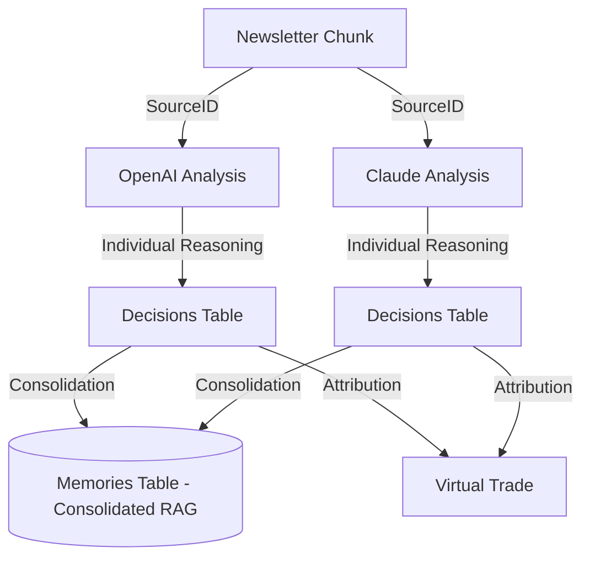

# Decision Attribution Walkthrough: Step 7

## 1. Objective
The **Decision Attribution Layer** creates a machine-auditable trail that links every trading decision (Buy/Sell/Hold) generated by an LLM to the specific newsletter chunk that triggered it. This ensures that the platform can provide clear reasoning for every trade in the virtual portfolio.

## 2. Implementation Details

### Database Schema
A new `decisions` table was created in Supabase to store the structured output from the LLMs.
- **Table:** `decisions`
- **Key Columns:**
    - `source_id`: Links to `newsletter_snapshots` (The specific news chunk).
    - `ticker`: The stock symbol involved.
    - `signal`: BUY, SELL, or HOLD.
    - `confidence`: 0-100 confidence score.
    - `reasoning`: The LLM's full text justification.
    - `model_provider`: e.g., "openai", "claude".
    - `model_name`: e.g., "gpt-4o", "claude-3-5-sonnet".

### Logic Changes
1. **Model Updates:** The `DecisionObject` Pydantic model was expanded to include `model_provider` and `model_name`.
2. **Analysis Orchestration:** The `analyze_chunks` function in `analyze.py` was updated to populate model metadata during the parallel processing loop.
3. **Persistence Layer:** A new `attribution` module was added to handle database communication via the Supabase client.

## 3. The Audit Trail
The following diagram illustrates how a trade is now attributed back to its source. Note that the `decisions` table preserves the **individual perspective** and raw reasoning of each model, even if they reach a consensus later.



## 4. Verification

### Automated Tests
Unit tests were implemented in `apps/engine/tests/test_attribution.py` to verify:
- Successful payload construction for Supabase.
- Proper error handling when database operations fail.

### Sample Pipeline Output
When running the `ingest` command, the engine now logs successful attribution:
```text
[AAPL] BUY (Conf: 85%): Saved attribution for openai/gpt-4o
[NVDA] HOLD (Conf: 92%): Saved attribution for deepseek/deepseek-chat
```
