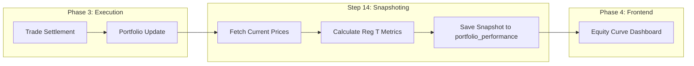

# Step 14: Ledger & Equity Curve Update

This document outlines the implementation and data flow for **Step 14**, which handles the recording of daily performance snapshots for each LLM-managed portfolio.

## 1. Goal
The primary goal of Step 14 is to provide an immutable record of each AI agent's portfolio performance at the end of every trading session. This data is the source of truth for the **Equity Curve** visualization on the frontend dashboard.

## 2. Technical Implementation

### Database Schema
We added a new table `portfolio_performance` to store these daily snapshots.

* **Table:** `public.portfolio_performance`
* **Columns:**
    * `portfolio_id`: Link to the specific LLM's portfolio.
    * `date`: The trading date for the snapshot.
    * `total_equity`: Net Liquidation Value (NLV).
    * `cash_balance`: Remaining cash/loan.
    * `buying_power`: Calculated Reg T buying power.
    * `sma`: Special Memorandum Account value.
    * `initial_margin_req`: Current initial margin requirement.
    * `maintenance_margin_req`: Current maintenance margin requirement.
    * `available_funds`: Surplus equity over initial margin.
    * `excess_liquidity`: Surplus equity over maintenance margin.

### Snapshot Logic (`portfolio.py`)
The `Portfolio` class now includes a `record_performance_snapshot()` method that:
1. Calculates latest Reg T metrics using today's closing prices.
2. Performs an **UPSERT** operation into the `portfolio_performance` table.
3. Uses a unique constraint on `(portfolio_id, date)` to ensure idempotency (rerunning the pipeline on the same day updates the existing snapshot rather than creating duplicates).

### Pipeline Integration (`main.py`)
At the end of the daily ingestion and execution loop:
1. The engine identifies all active LLM portfolios.
2. It fetches the latest market prices for all currently held positions.
3. It triggers the snapshot recorded for every agent, even those who didn't make trades today.

## 3. Data Flow Overview

## 4. Verification
The implementation is verified by the following test suite:
* `apps/engine/tests/test_performance_snapshot.py`: Verifies accuracy of snapshot calculations and idempotency.

---
[[back to Overview](../Overview.md)]
