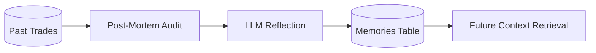

# Walkthrough: Regret-Driven Reinforcement (Post-Mortem)

The **Regret-Driven Reinforcement Loop** is a self-correcting mechanism that allows AI agents to reflect on their past trades, learn from their mistakes, and store those lessons in long-term memory.

## 1. The Feedback Loop
Standard RAG systems provided the AI with news and historical context. This loop adds a third layer: **Performance Feedback**.



## 2. Core Logic
The audit resides in [post_mortem.py](file:///Users/cesarvega/Documents/p-code/llm-market-bench/apps/engine/analysis/post_mortem.py).

### **Execution Steps:**
1.  **Temporal Windowing**: The engine identifies trades executed exactly **5 days ago**. This provides enough time for market reaction without the data becoming stale.
2.  **Performance Calculation**:
    - Fetches the current market price for the ticker.
    - Calculates the 5-day return.
3.  **LLM Reflection**:
    - The original **Reasoning** and the **Outcome** are sent to the **Manager Agent** (Gemini Flash 3).
    - The model evaluates if its original logic was flawed, if it hallucinated, or if it missed a key macro indicator.
4.  **Memory Synthesis**:
    - A concise **Lesson Learned** is generated.
    - This is injected into the `memories` table with a `memory_type: "LESSON_LEARNED"` and `type: "post_mortem"` metadata tag.

## 3. How it Improves Strategy
In subsequent runs, when an AI agent researches the *same* ticker or sector, the RAG system retrieves these post-mortems alongside news. 

- **Example**: *"Lesson Learned: Avoid buying [Ticker] on 'rumored' M&A news from unverified sources; price action 5 days later showed a 12% drop as rumors were debunked."*

## 4. Verification
Run the post-mortem analysis manually via the CLI:

```bash
python main.py post-mortem
```

Check the engine logs for evidence of memory injection:
```text
INFO: Generated post-mortem memory for TSLA (BUY). Lesson: Avoid over-optimism on delivery targets during rate hike cycles.
```

## 5. Persistence
Lessons are stored in the database and can be queried via Supabase:
```sql
SELECT content FROM memories WHERE memory_type = 'LESSON_LEARNED';
```
