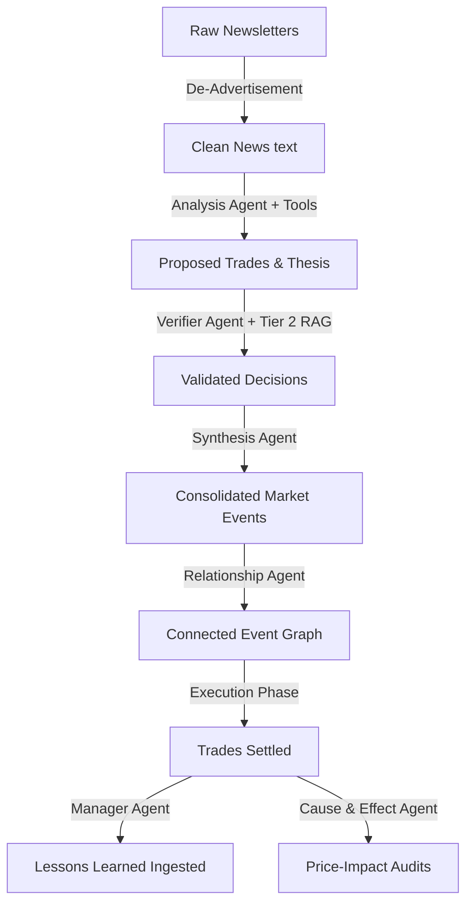

# Multi-Agent System Overview

The "LLM Market Bench" platform relies on an orchestrated network of **7 specialized agents** to perform news ingestion, investment analysis, risk verification, consensus building, execution, post-mortem learning, and retrospective audits.

All agent prompt pairs follow the [[concepts/system-heavy-prompt]] and [[concepts/tool-first-agency]] design: trading agents operate on pull-based tool discovery rather than injected data dumps, while deterministic pipeline utilities receive minimal input payloads.

---

## The 7 Specialized Agents

### 1. Analysis Agent
- **Role**: The core driver of trading decisions. It evaluates newsletter snaps, global macro indicators, and portfolio status to identify investable ideas. It runs 5 parallel instances (OpenAI, Anthropic, Gemini, DeepSeek, and MiniMax).
- **Prompt Pair**: `CORE_ANALYSIS_SYSTEM_PROMPT` / `ANALYSIS_USER_PROMPT_TEMPLATE`
- **Evolvable**: **Yes** (for OpenAI/Anthropic/Gemini/DeepSeek). This is the only system prompt managed by the [[entities/autoresearch]] engine, which iteratively mutates it to optimize risk-adjusted returns (the Karpathy Ratchet). Note: MiniMax is run under a fixed system prompt variant and is bypass-routed around direct prompt-evolution.
- **Primary Tools**: `get_stock_quote`, `get_price_history`, `calculate_buy_quantity`, `calculate_sell_quantity`, `web_search`, `stock_screener`, `get_uncorrelated_assets`, `search_prediction_markets`, `get_prediction_market_odds`, `fetch_newsletter_content`, `search_past_memories`. (Note: MiniMax-M3 executes through the Anthropic SDK tool loop via `handlers/anthropic.run_tool_loop`, pointed at MiniMax's Anthropic-compatible endpoint).

### 2. Verifier Agent
- **Role**: Operates as a double-check guardrail. It cross-examines proposed trade actions against past agent decisions, historical lessons learned, and empirical financial science.
- **Prompt Pair**: `VERIFIER_SYSTEM_PROMPT` / `VERIFIER_USER_PROMPT_TEMPLATE`
- **Evolvable**: No.
- **Primary Context**: Tier 2 RAG via `retrieve_for_decision()`, including the top seeded empirical asset pricing academic papers.
- **Primary Tools**: `get_stock_quote`, `get_price_history`, `get_volatility_metrics`, `get_sector_alternatives` (hybrid retrieval aggregating FMP industry screener competitors, statistical database correlations, and past decision history), and `audit_financial_valuation` (server-side DCF & multiples consistency verifier).
- **Execution Safeguards**:
  - **Case-Insensitive Gates**: Safely bypasses mixed/lowercase `"HOLD"` signals without calling the backend LLM.
  - **Specialized Provider Mapping & Cost Optimization**: Dynamically routes verifications to the matching provider client while substituting lightweight models where appropriate (e.g. routing all `deepseek` trade verifications and `deepseek_reasoner` to `DEEPSEEK_FLASH_MODEL` to avoid high reasoning token costs).
  - **DeepSeek Thinking Mode**: Enables thinking mode (`extra_body={"thinking": {"type": "enabled"}}`) during final verification extraction to perform deep DCF and valuation audits, while suppressing thinking during tool execution to avoid hallucinated tool call narration.
  - **OpenAI Reasoning Compatibility**: Sets `reasoning_effort="none"` on Instructor verification extraction calls to ensure OpenAI reasoning models (`gpt-5.6-luna`) cleanly execute function tools on `/v1/chat/completions`.
  - **Transient Retry Resilience**: Performs up to 3 attempts with exponential backoff for transient HTTP errors (429, timeouts, bad gateways, connection drops) before falling back to fail-safe rejection.

### 4. Synthesis Agent
- **Role**: Consolidates separate raw trade decisions and news insights across parallel analysis runs into a clean, unified set of "market events," extracting catalysts and catalyst dates while avoiding redundant trade signals.
- **Prompt Pair**: `SYNTHESIS_SYSTEM_PROMPT` / `SYNTHESIS_USER_PROMPT_TEMPLATE`
- **Evolvable**: No.
- **Pipeline Phase**: Phase 4: Consensus (see [[entities/pipeline]]).

### 5. Manager Agent
- **Role**: Executes multi-horizon post-mortems (short, medium, and long term) of executed trades. It compares the original thesis with actual market outcomes to generate persistent `LESSON_LEARNED` memories.
- **Prompt Pair**: `MANAGER_SYSTEM_PROMPT` / `MANAGER_USER_PROMPT_TEMPLATE`
- **Evolvable**: No.
- **Pipeline Phase**: Phase 6: Feedback.

### 6. Relationship Agent
- **Role**: Tracks how market events evolve over time. It analyzes promoted events against the existing database to determine chronological and semantic relationships, classifying links as `UPDATE`, `REVERSAL`, or `RESOLUTION`.
- **Prompt Pair**: `RELATIONSHIP_SYSTEM_PROMPT` / `RELATIONSHIP_USER_PROMPT_TEMPLATE`
- **Evolvable**: No.

### 7. Cause & Effect Agent
- **Role**: Conducts retrospective empirical audits. It examines historical scenario predictions made by the agents and maps them to subsequent price actions to verify narrative validity.
- **Prompt Pair**: `CAUSE_AND_EFFECT_SYSTEM_PROMPT` / `CAUSE_AND_EFFECT_USER_PROMPT_TEMPLATE`
- **Evolvable**: No.

### 8. De-Advertisement Agent
- **Role**: Sanitizes raw newsletter snap text. It strips out marketing hooks, advertisements, affiliate links, and promotional clutter, ensuring the Analysis Agent receives high-signal financial text.
- **Prompt Pair**: `DE_ADVERTISEMENT_SYSTEM_PROMPT` / `DE_ADVERTISEMENT_USER_PROMPT_TEMPLATE`
- **Evolvable**: No.

---

## Thinking Agents Architecture

All agent arenas and predictors across the system operate as thinking agents while preserving native tool execution capabilities:

### Single Pipeline Task vs Multi-Turn Tool Loops
- **Pipeline Step**: From the orchestrator perspective (e.g. daily predictor, pre-market analysis, verification, autoresearcher), an evaluation is a **single asynchronous pipeline task**.
- **Iterative Tool Loop**: Internally, `run_tool_loop` executes up to `max_tool_steps` (default 5 iterations). If an LLM calls Tool A (e.g., `get_stock_quote`), the engine executes it, sends the result back in the message history, and allows the model to evaluate the result in its internal thinking trace before deciding to call Tool B (e.g., `get_options_sentiment`), and finally sizing with `calculate_buy_quantity`.
- **Performance Impact**: Sequential multi-turn tool calling does not degrade system performance. Bounded token budgets (1,024 to 2,048 tokens) and capped tool steps keep wall-clock runtime fast (typically 2-6 seconds total), while grounding every decision on real market data.

### Provider Execution Contracts
- **Anthropic (`claude-haiku-4-5`)**:
  - Sets `thinking={"type": "enabled", "budget_tokens": 2048}` during tool loops.
  - Multi-turn tool execution preserves `ThinkingBlock` elements in assistant history across turns.
  - Structured extraction uses `Mode.ANTHROPIC_JSON` via Instructor to avoid forced `tool_choice`, preventing 400 errors.
- **Gemini (`gemini-3.5-flash-lite`)**:
  - Uses `types.ThinkingConfig(thinking_budget=2048)` in `GenerateContentConfig`.
  - Native `types.Content` objects preserve thought parts and function call IDs across turns.
- **DeepSeek (`deepseek-v4-flash`)**:
  - Enables `extra_body={"thinking": {"type": "enabled"}}` during structured extraction and reasoning steps across all tasks.
  - Suppresses thinking during the tool execution loop so the model emits structured API `tool_calls` rather than narrating tool usage in thinking prose.
- **OpenAI (`gpt-5.6-luna`)**:
  - Sets `reasoning_effort="none"` during tool calling and extraction when function tool messages are in history, as required by OpenAI `/v1/chat/completions`.
- **MiniMax (`MiniMax-M3`)**:
  - Interfaces via Anthropic-compatible format with `Mode.ANTHROPIC_JSON` for reliable structured extraction.

---

## Agent Flow & Interactions

## Related

- [[concepts/thinking-agents]] — Thinking agents architecture, historical blockers, and provider execution contracts
- [[concepts/tool-first-agency]] — Tool-first, agency-driven architecture and dual-taxonomy
- [[concepts/system-heavy-prompt]] — prompt architecture design
- [[entities/pipeline]] — the daily running lifecycle
- [[concepts/reasoning]] — reasoning loops, the 5 Whys, and the Reasoning Toolbox
- [[concepts/minimax-portfolio]] — simplified portfolio execution model
- [[concepts/memory-feedback]] — post-mortem feedback loops
