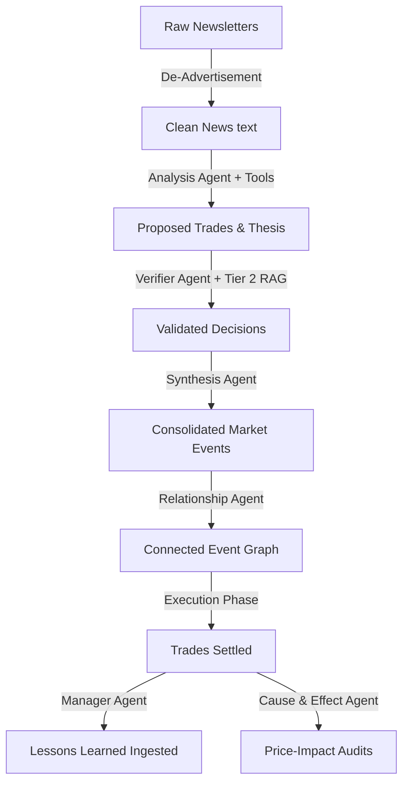

# Multi-Agent System Overview

The "LLM Market Bench" platform relies on an orchestrated network of **8 specialized agents** to perform news ingestion, investment analysis, risk verification, consensus building, execution, post-mortem learning, and retrospective audits.

All agent prompt pairs follow the [[concepts/system-heavy-prompt]] design, decoupling instruction rules (System message) from dynamic data injection (User message).

---

## The 8 Specialized Agents

### 1. Analysis Agent
- **Role**: The core driver of trading decisions. It evaluates newsletter snaps, global macro indicators, and portfolio status to identify investable ideas. It runs 5 parallel instances (OpenAI, Anthropic, Gemini, DeepSeek, and MiniMax).
- **Prompt Pair**: `CORE_ANALYSIS_SYSTEM_PROMPT` / `ANALYSIS_USER_PROMPT_TEMPLATE`
- **Evolvable**: **Yes** (for OpenAI/Anthropic/Gemini/DeepSeek). This is the only system prompt managed by the [[entities/autoresearch]] engine, which iteratively mutates it to optimize risk-adjusted returns (the Karpathy Ratchet). Note: MiniMax is run under a fixed JSON system prompt variant and is bypass-routed around direct prompt-evolution.
- **Primary Tools**: `get_stock_quote`, `get_price_history`, `calculate_buy_quantity`, `calculate_sell_quantity`, `web_search`, `stock_screener`, `get_uncorrelated_assets`. (Note: MiniMax skips tool use loops entirely and generates structural JSON decisions directly).

### 2. Contrarian Agent
- **Role**: Conducts a crowded-trade analysis. It identifies structural blindspots, potential tail risks, and over-crowded consensus in the primary decisions, executing counter-trades in a dedicated portfolio to harvest contrarian alpha.
- **Prompt Pair**: `CONTRARIAN_SYSTEM_PROMPT` / `CONTRARIAN_USER_PROMPT_TEMPLATE`
- **Evolvable**: No.
- **Primary Context**: Fresh live market quotes (`force_refresh=True`) to spot immediate narrative divergence.

### 3. Verifier Agent
- **Role**: Operates as a double-check guardrail. It cross-examines proposed trade actions against past agent decisions, historical lessons learned, and empirical financial science.
- **Prompt Pair**: `VERIFIER_SYSTEM_PROMPT` / `VERIFIER_USER_PROMPT_TEMPLATE`
- **Evolvable**: No.
- **Primary Context**: Tier 2 RAG via `retrieve_for_decision()`, including the top seeded empirical asset pricing academic papers.

### 4. Synthesis Agent
- **Role**: Consolidates separate raw trade decisions and news insights across parallel analysis runs into a clean, unified set of "market events," extracting catalysts and catalyst dates while avoiding redundant trade signals.
- **Prompt Pair**: `SYNTHESIS_SYSTEM_PROMPT` / `SYNTHESIS_USER_PROMPT_TEMPLATE`
- **Evolvable**: No.
- **Pipeline Phase**: Phase 4: Consensus (see [[entities/pipeline]]).

### 5. Manager Agent
- **Role**: Executes multi-horizon post-mortems (short, medium, and long term) of executed trades. It compares the original thesis with actual market outcomes to generate persistent `LESSON_LEARNED` memories.
- **Prompt Pair**: `MANAGER_SYSTEM_PROMPT` / `MANAGER_USER_PROMPT_TEMPLATE`
- **Evolvable**: No.
- **Pipeline Phase**: Phase 6: Feedback.

### 6. Relationship Agent
- **Role**: Tracks how market events evolve over time. It analyzes promoted events against the existing database to determine chronological and semantic relationships, classifying links as `UPDATE`, `REVERSAL`, or `RESOLUTION`.
- **Prompt Pair**: `RELATIONSHIP_SYSTEM_PROMPT` / `RELATIONSHIP_USER_PROMPT_TEMPLATE`
- **Evolvable**: No.

### 7. Cause & Effect Agent
- **Role**: Conducts retrospective empirical audits. It examines historical scenario predictions made by the agents and maps them to subsequent price actions to verify narrative validity.
- **Prompt Pair**: `CAUSE_AND_EFFECT_SYSTEM_PROMPT` / `CAUSE_AND_EFFECT_USER_PROMPT_TEMPLATE`
- **Evolvable**: No.

### 8. De-Advertisement Agent
- **Role**: Sanitizes raw newsletter snap text. It strips out marketing hooks, advertisements, affiliate links, and promotional clutter, ensuring the Analysis Agent receives high-signal financial text.
- **Prompt Pair**: `DE_ADVERTISEMENT_SYSTEM_PROMPT` / `DE_ADVERTISEMENT_USER_PROMPT_TEMPLATE`
- **Evolvable**: No.

---

## Agent Flow & Interactions

## Related

- [[concepts/system-heavy-prompt]] — prompt architecture design
- [[entities/pipeline]] — the daily running lifecycle
- [[concepts/reasoning]] — reasoning loops and the 5 Whys
- [[concepts/minimax-portfolio]] — simplified portfolio execution model
- [[concepts/memory-feedback]] — manager and contrarian feedback
