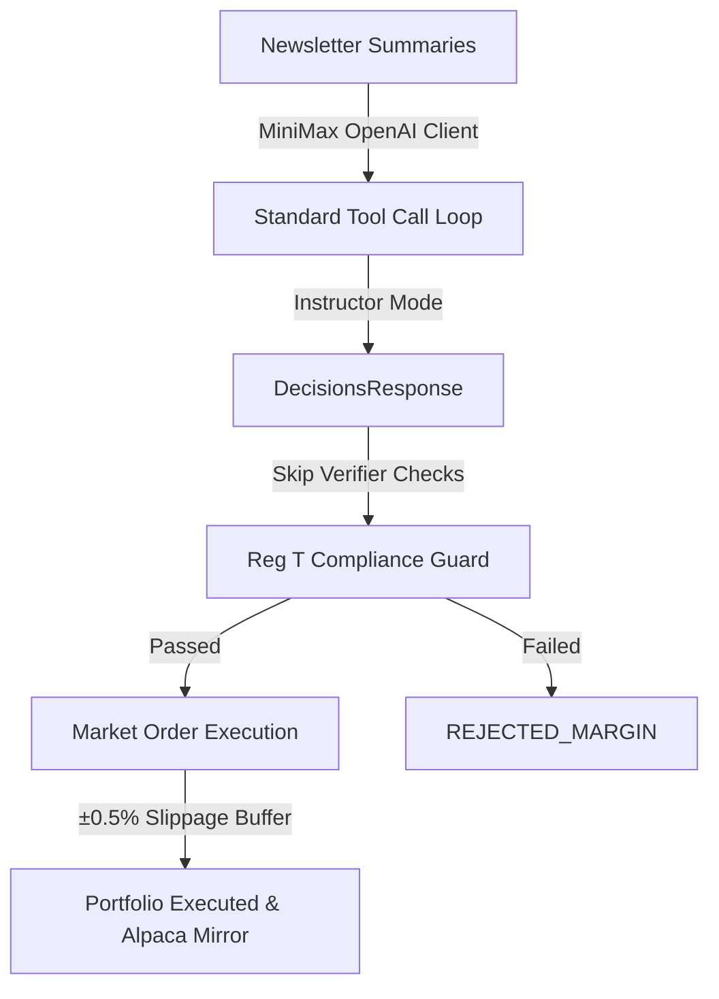

# MiniMax-M3 Simple Portfolio

The MiniMax-M3 Simple Portfolio represents a high-velocity, low-friction execution path within the LLM Market Bench platform. Designed for the `MiniMax-M3` model provider, this portfolio demonstrates how a simplified order and verification structure can optimize responsiveness while maintaining strict risk controls.

## Design Rationale

Standard portfolios on the platform (OpenAI, Anthropic, Gemini, DeepSeek) are subjected to a rigorous **4-Layer Defense System** to prevent hallucinations, check semantic redundancies, verify against historical post-mortems, and validate stale market data. While highly robust, these checks add computational overhead and can sometimes prematurely block valid signals due to strict formatting rule sets.

The MiniMax portfolio implements a **Simplified Execution Pipeline**:

By removing intermediary check-and-balance steps (like the Verifier Agent), the MiniMax agent trades with raw cognitive output, operating in a simplified cash/ownership context while remaining firmly inside the system's margin constraints. However, it now participates in standard tool calling loops (like web searches, database RAG, and newsletter content fetching) just like standard models.

---

## Simplified Pipeline Comparison

| Verification Layer | Standard Portfolios | MiniMax Portfolio |
| :--- | :--- | :--- |
| **Layer 1: Pre-Prompt Strengthening** | ✅ Enforced | ✅ Enforced |
| **Layer 2: Context Enhancement** | ✅ Enforced | ✅ Enforced |
| **Layer 3: Post-Analysis Verification** | ✅ Enforced | ❌ Bypassed |
| **Layer 4: Structured Output Isolation** | ✅ Enforced | ✅ Enforced (via Instructor) |
| **Semantic Overlap & Redundancy** | ✅ Validated | ❌ Bypassed |
| **Stale Quote Drift (>2% Guardrail)** | ✅ Validated | ❌ Bypassed |
| **Reg T Margin / Buying Power Floor** | ✅ Enforced | ✅ Enforced |
| **Asset Ownership Stop (SELL)** | ✅ Enforced | ✅ Enforced |

---

## Market Order execution & ±0.5% Buffer

Rather than placing `DAY` limit orders directly at the JIT market price, the MiniMax execution engine utilizes **Market Orders** modeled with a **±0.5% execution slippage buffer** to ensure near-instantaneous execution during live simulation:

### 1. Engine Buy/Sell Offset
* **BUY Decisions**: The execution price is adjusted upward by `0.5%` to simulate buying at the ask price in a high-liquidity order book.
  $$\text{Price}_{\text{exec}} = \text{round}(\text{Price}_{\text{market}} \times 1.005, 2)$$
* **SELL Decisions**: The execution price is adjusted downward by `0.5%` to simulate selling at the bid price.
  $$\text{Price}_{\text{exec}} = \text{round}(\text{Price}_{\text{market}} \times 0.995, 2)$$

### 2. Alpaca Paper Mirroring
To maintain synchronization with real broker mechanics, the corresponding Alpaca paper trading limit orders are mirrored using the same `0.5%` offset applied on top of the calculated `exec_price`:
* **Alpaca BUY Limit**: $\text{round}(\text{Price}_{\text{exec}} \times 1.005, 2)$
* **Alpaca SELL Limit**: $\text{round}(\text{Price}_{\text{exec}} \times 0.995, 2)$

To prevent duplicate Alpaca submissions (since the shared `portfolio.execute_trade` method automatically schedules a default `0.5%` slippage mirror), the MiniMax pipeline passes `skip_alpaca_mirror=True` to `execute_trade`. This bypasses the standard mirroring flow, allowing the custom `0.5%` offset mirror to run cleanly inside `main.py` without duplicate `client_order_id` rejections.

---

## Retained Risk Guardrails

While the MiniMax portfolio bypasses post-analysis verifier checks and semantic validators, it remains 100% compliant with the underlying financial and asset-sanity boundaries of the system:

1. **Existence & Liquidity Checks**: The ticker must exist on Financial Modeling Prep (FMP) and have a market capitalization exceeding the platform's liquidity floor.
2. **Market Hours Compliance**: Orders can only be processed during active US market hours.
3. **Hard Ownership Stop**: SELL orders targeting assets that do not exist in the active `positions` ledger are immediately rejected (`REJECTED_OWNERSHIP`). Additionally, requested quantities exceeding the active position are automatically capped to the quantity currently held.
4. **Reg T Margin Validation**: The trade is evaluated JIT by `portfolio.validate_trade()` to ensure it does not breach initial margin requirements, maintenance margin thresholds, or SMA boundaries. If buying power is insufficient, the trade is rejected with `REJECTED_MARGIN`.

---

## Leaderboard Metrics Adjustment

Because MiniMax-M3 operates on a simplified execution pipeline bypassing the verifier and tool-scans (Layer 3), its **verifier approval rate metric is ignored** on the LLM Leaderboard (returning `NULL`).

Consequently, the calculation of its reasoning and composite scores is adjusted automatically at the database layer:
* **Reasoning Quality Score**: Set to $100\%$ of average self-reported confidence, omitting the verifier rate check.
* **Composite Leaderboard Score**: Weighted as:
  $$\text{Composite Score} = (0.5 \times \text{Performance Score}) + (0.3 \times \text{Average Confidence}) + (0.2 \times \text{Consistency Score})$$

See `[[entities/llm-leaderboard]]` for more details.

---

## Extraction and Parser Alignment

MiniMax-M3 supports both the OpenAI-compatible and Anthropic-compatible API formats. The analysis pipeline now uses the **Anthropic SDK** pointed at MiniMax's Anthropic-compatible endpoint (`https://api.minimax.io/anthropic`), wrapped by Instructor's `from_anthropic` factory. This route gives M3 native `tool_use` content blocks (matching the protocol the rest of the analysis pipeline already speaks via `handlers/anthropic.run_tool_loop`) and unlocks M3's thinking control.

### Why Anthropic SDK for the analysis path

1. **Native tool_use blocks.** M3 via the Anthropic endpoint emits proper `tool_use` content blocks. The OpenAI endpoint had been returning raw JSON text prefixed with literal `JSON` (e.g. `'JSON{\n  "decisions": [...]'`), which broke Instructor's default `Mode.TOOLS` parser with `"No tool calls or function call found in response (mode: TOOLS)"` and silently dropped the batch's 3 decisions + 6 macro_events.
2. **Reuse of battle-tested tool-loop handler.** The existing `handlers/anthropic.run_tool_loop` already handles `tool_use` ↔ `function_response` circulation, multi-turn context, and `thought_signature` for Gemini 3. M3 reuses the same code path.
3. **Retry predicate widened.** As defense-in-depth, the Instructor extraction retry loop now also catches `"no tool calls"` / `"function call found"` substrings (in addition to `"validation error"` / `"list_type"`), so any future provider that emits raw JSON instead of tool_calls will trigger JSON repair instead of raising immediately.

### OpenAI-compatible endpoint still in use (auxiliary flows)

Auxiliary modules that don't need tool calling (e.g. the [[concepts/market-feeling]] generator, `tasks/sector_predictor.py`) keep using the raw MiniMax Text Chat API via `core/llm/minimax.MiniMaxClient` (`https://api.minimax.io/v1/text/chatcompletion_v2`). These flows benefit from the simpler `response_format={"type": "json_object"}` round-trip and don't need Anthropic-format `tool_use` plumbing.

### JSON repair helpers (defense-in-depth, retained)

For flows that still hit raw JSON parsing paths, the following robustness logic is preserved in `core/llm/minimax.py` and `core/llm/analysis.py`:
1. **Explicit Schema Enforcement:** The prompt template specifically instructs the model on the exact JSON schema fields to prevent validation errors at execution time.
2. **Conditional Unescaping & Escape Alignment:** The JSON repair helper (`_repair_json_string` in `core/llm/analysis.py`) performs quote (`\"` to `"`) and backslash-escaped newline unescaping inside double-escaped strings to ensure JSON compatibility.
3. **Robust Scope Binding:** Fallback strategy lambdas in `_try_parse_decisions_response` bind repaired variables correctly to avoid closed-over variable references that could lead to evaluation failures.
4. **Raw Control Character Resiliency:** All `json.loads` calls in the MiniMax client and repair utilities use `strict=False` to tolerate unescaped control characters such as newlines or carriage returns in reasoning content.
5. **TOOLS-Mode Repair Trigger:** The retry predicate now also matches `"no tool calls"` / `"function call found"` so a misconfigured provider that emits raw JSON triggers the repair path instead of dropping the batch.

---

## Safety and Censorship Failure Modes

Due to MiniMax being hosted by a Chinese provider with strict content moderation policies, the model is highly sensitive to geopolitical keywords (e.g. "Iran Deal", "Strait of Hormuz", "military conflicts").
* **Symptom**: The API returns a `200 OK` extremely rapidly (e.g. 2ms) but with a blank choice content or finish reason other than `stop`.
* **Observability & Logging**:
  - **Empty Content/Choices**: If the API returns a success status but contains empty choices or the final extracted content is blank, the engine logs a warning containing the full raw response for diagnostics.
  - **HTTP Status Errors**: If the MiniMax API returns a non-200 HTTP status code, `MiniMaxClient` catches the `httpx.HTTPStatusError`, extracts and logs the detailed response body (e.g., quota or authorization failure messages), and re-raises it.
  - **Business Logic Errors (`base_resp` or `error`)**: MiniMax sometimes returns `200 OK` but includes errors in the JSON body (under `base_resp` or `error` keys). `MiniMaxClient` parses these keys, logs the specific error message, and raises a `ValueError` to ensure visibility.

---

## Related Pages

* [[entities/engine]]
* [[concepts/execution]]
* [[concepts/tool-enforcement]]
* [[sources/reg-t-calculations-source]]
