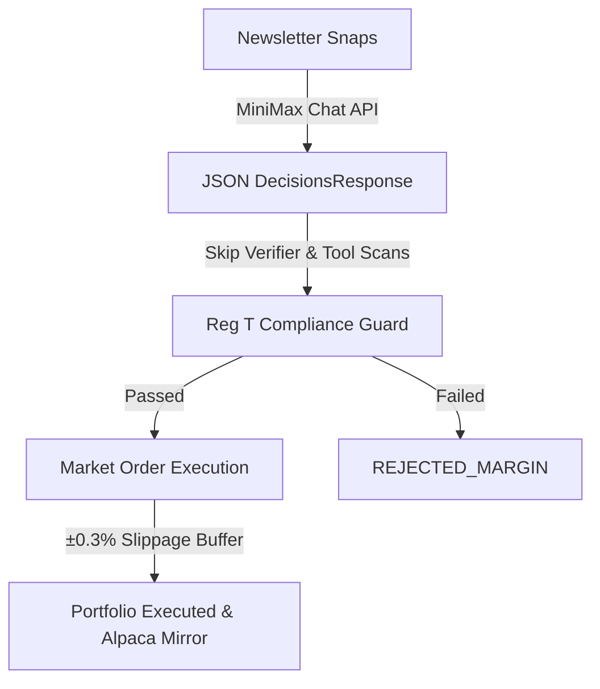

# MiniMax 2.7 Simple Portfolio

The MiniMax 2.7 Simple Portfolio represents a high-velocity, low-friction execution path within the LLM Market Bench platform. Designed for the `MiniMax-M2.7` model provider, this portfolio demonstrates how a simplified order and verification structure can optimize responsiveness while maintaining strict risk controls.

## Design Rationale

Standard portfolios on the platform (OpenAI, Anthropic, Gemini, DeepSeek) are subjected to a rigorous **4-Layer Defense System** to prevent hallucinations, check semantic redundancies, verify against historical post-mortems, and validate stale market data. While highly robust, these checks add computational overhead and can sometimes prematurely block valid signals due to strict formatting rule sets.

The MiniMax portfolio implements a **Simplified Execution Pipeline**:

By removing intermediary check-and-balance steps, the MiniMax agent trades with raw cognitive output, operating in a simplified cash/ownership context while remaining firmly inside the system's margin constraints.

---

## Simplified Pipeline Comparison

| Verification Layer | Standard Portfolios | MiniMax Portfolio |
| :--- | :--- | :--- |
| **Layer 1: Pre-Prompt Strengthening** | ✅ Enforced | ✅ Enforced |
| **Layer 2: Context Enhancement** | ✅ Enforced | ✅ Enforced |
| **Layer 3: Post-Analysis Verification** | ✅ Enforced | ❌ Bypassed |
| **Layer 4: Structured Output Isolation** | ✅ Enforced | ❌ Bypassed |
| **Semantic Overlap & Redundancy** | ✅ Validated | ❌ Bypassed |
| **Stale Quote Drift (>2% Guardrail)** | ✅ Validated | ❌ Bypassed |
| **Reg T Margin / Buying Power Floor** | ✅ Enforced | ✅ Enforced |
| **Asset Ownership Stop (SELL)** | ✅ Enforced | ✅ Enforced |

---

## Market Order execution & ±0.3% Buffer

Rather than placing `DAY` limit orders directly at the JIT market price, the MiniMax execution engine utilizes **Market Orders** modeled with a **±0.3% execution slippage buffer** to ensure near-instantaneous execution during live simulation:

### 1. Engine Buy/Sell Offset
* **BUY Decisions**: The execution price is adjusted upward by `0.3%` to simulate buying at the ask price in a high-liquidity order book.
  $$\text{Price}_{\text{exec}} = \text{round}(\text{Price}_{\text{market}} \times 1.003, 2)$$
* **SELL Decisions**: The execution price is adjusted downward by `0.3%` to simulate selling at the bid price.
  $$\text{Price}_{\text{exec}} = \text{round}(\text{Price}_{\text{market}} \times 0.997, 2)$$

### 2. Alpaca Paper Mirroring
To maintain synchronization with real broker mechanics, the corresponding Alpaca paper trading limit orders are mirrored using the same `0.3%` offset applied on top of the calculated `exec_price`:
* **Alpaca BUY Limit**: $\text{round}(\text{Price}_{\text{exec}} \times 1.003, 2)$
* **Alpaca SELL Limit**: $\text{round}(\text{Price}_{\text{exec}} \times 0.997, 2)$

---

## Retained Risk Guardrails

While the MiniMax portfolio bypasses tool-loop formatting checks and semantic validators, it remains 100% compliant with the underlying financial and asset-sanity boundaries of the system:

1. **Existence & Liquidity Checks**: The ticker must exist on Financial Modeling Prep (FMP) and have a market capitalization exceeding the platform's liquidity floor.
2. **Market Hours Compliance**: Orders can only be processed during active US market hours.
3. **Hard Ownership Stop**: SELL orders targeting assets that do not exist in the active `positions` ledger are immediately rejected (`REJECTED_OWNERSHIP`). Additionally, requested quantities exceeding the active position are automatically capped to the quantity currently held.
4. **Reg T Margin Validation**: The trade is evaluated JIT by `portfolio.validate_trade()` to ensure it does not breach initial margin requirements, maintenance margin thresholds, or SMA boundaries. If buying power is insufficient, the trade is rejected with `REJECTED_MARGIN`.

---

## Related Pages

* [[entities/engine]]
* [[concepts/execution]]
* [[concepts/tool-enforcement]]
* [[sources/reg-t-calculations-source]]
