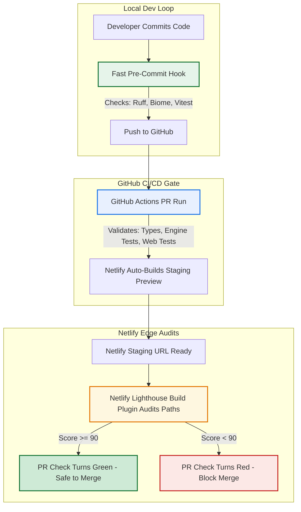

# Performance Auditing Strategy

Establish a high-fidelity, low-friction, cloud-native performance auditing pipeline to protect the application's user experience without dragging down developer velocity.

## Context & Vision

Web performance is a critical factor for trading dashboards and high-interactivity applications. Historically, developers audited performance via local headless browser passes (e.g. Husky pre-commit hooks), which introduced severe velocity bottlenecks and flaky false-positives due to local CPU and network resource variance.

To build a scalable engineering workflow, we offload heavy synthetic auditing to our hosting provider's cloud edge (**Netlify Deploy Previews**) while keeping local developer loops fast and lightweight.

---

## Comparison Matrix: Performance Auditing Strategies

| Strategy | Run Location | Velocity Impact (Developer Flow) | Score Accuracy & Flake Risk | Best Used For |
| :--- | :--- | :--- | :--- | :--- |
| **Pre-Commit Hook** | Local Machine | **High Drag** (+15–45s per commit unless highly optimized) | **Poor** (Extreme variance based on local background CPU tasking) | Small, fast static landing pages; catching layout shifts instantly before pushes. |
| **GitHub Actions (CI/CD)** | Ephemeral Cloud VM | **Low Drag** (Asynchronous; runs entirely in background) | **Moderate** (Noiser shared cloud hardware, but highly consistent rules) | Standard regression testing; blocking bad code merges on Pull Requests. |
| **Netlify Deploy Previews** | Production Edge CDN | **Zero Drag** (Triggered after a cloud build deployment finishes) | **Excellent** (Audits a real public server link; highly deterministic) | Comprehensive frontend testing; production-parity Core Web Vitals checks. |

---

## Unified Blueprint: Layered Quality Gates

Our pipeline layers validation checks contextually so they do not obstruct developer velocity:



---

## Technical Implementation

### Netlify Lighthouse Plugin Configuration

The pipeline leverages `@netlify/plugin-lighthouse` registered directly in [netlify.toml](file:///Users/cesarvega/Documents/p-code/llm-market-bench/apps/web/netlify.toml).

```toml
# NOTE: In the actual netlify.toml file, do NOT include spaces inside the double brackets.
# Use standard double-bracketed plugins and plugins.inputs.audits syntax. Spaces are shown here 
# solely to prevent wiki cross-reference linter false-positives.

[ [plugins] ]
  package = "@netlify/plugin-lighthouse"

  [plugins.inputs]
    fail_deploy_on_score_thresholds = true

  [plugins.inputs.thresholds]
    performance = 0.90
    accessibility = 0.90
    best-practices = 0.90
    seo = 0.90

  [ [plugins.inputs.audits] ]
    path = "/"

  [ [plugins.inputs.audits] ]
    path = "/how-it-works"

  [ [plugins.inputs.audits] ]
    path = "/portfolios"
```

### Key Mechanisms:
- **Build Failures**: When `fail_deploy_on_score_thresholds` is set to `true`, a drop below **90** on any target route in Performance, Accessibility, Best Practices, or SEO will cause the Netlify deployment step to fail. This automatically flags the associated status check in the GitHub Pull Request as red.
- **Audit Target Routes**: We audit our primary landing page (`/`), core informational page (`/how-it-works`), and main trading portfolio overview dashboard (`/portfolios`).

---

## Technical Mitigations & Best Practices

To safeguard performance and achieve high-fidelity Core Web Vitals, all frontend and backend database implementations must adhere to the following optimized engineering guidelines:

### 1. Eliminating SSR Hydration Mismatches (React Error #418)
Hydration failures occur when the initial HTML rendered on the server differs from the DOM generated by the client during initial hydration. This causes React to throw out the SSR markup, triggering a costly full-page layout reflow and rendering delay.

*   **No Randomization in SSR Layouts**: Never invoke non-deterministic functions (e.g., `Math.random()`) during the initial component render. If dynamic or randomized features are required, perform them inside a `useEffect` hook, which runs exclusively on the client after initial hydration is secure.
*   **Market Timezone Standardizations**: For time-sensitive or date-dependent elements, explicitly define the Eastern Time timezone (`America/New_York`) inside formatter parameters (e.g., `toLocaleDateString('en-US', { timeZone: 'America/New_York' })`). This guarantees that headless edge servers (running on UTC) and worldwide client browsers render identical, timezone-stable outputs.
*   **Deterministic Timestamps over Skewed Deltas**: Avoid relative time formats (e.g., `"X minutes ago"`) calculated relative to a dynamic `now` clock. Instead, render static, timezone-explicit timestamps (e.g., `10:45 AM ET`), eliminating hydration failures caused by minor clock-skew differences between the server and client.

### 2. Slashing Initial Server Response Times (TTFB)
Initial server response times depend directly on the database queries executed during the loading stage.
*   **Rolling Lookback Filters**: When querying massive chronological data tables (such as `price_history` for rolling calculations), always enforce a strict lookback date range filter at the database layer (e.g., `.gte('fetched_at', lookbackDate.toISOString())` restricted to the last 45 days). Never fetch the entire historical database table only to filter rows in memory.

---

## Developer Guide

### Manual Whole-Site Audits (Unlighthouse)
To check performance, Core Web Vitals, accessibility, and SEO across the entire sitemap locally without waiting for CI/CD deployments:

```bash
# Run a quick, zero-install audit against a production or preview URL
npx unlighthouse --site https://benchify.netlify.app/
```
Unlighthouse will automatically crawl the sitemap, run Lighthouse in parallel across discovered routes, and launch a local visual dashboard at `http://localhost:5678/` detailing specific opportunities.

### Mitigating Failures & Regression Debugging
If a deploy check fails because of a score drop:
1. Open the failed check logs on Netlify or the markdown table posted in the GitHub PR comments.
2. Locate which route failed (e.g. `/portfolios`) and which category dropped.
3. Boot your local dev environment (`pnpm dev:web`) and run Chrome DevTools Lighthouse or PageSpeed Insights on your preview server.
4. Check for common regression culprits:
   - Accidental large image imports without sizing constraints.
   - Dynamic imports / code splitting failures (overly large chunk sizes).
   - Missing Alt attributes or aria-labels (accessibility drops).
   - Core Web Vitals issues such as Cumulative Layout Shifts (`CLS`) or Largest Contentful Paint (`LCP`) regressions.

### Bypassing in Emergencies
If a deployment is absolutely critical and blocked by a minor score variance or an external API delay, you can disable the build plugin checks temporarily by modifying `netlify.toml` directly or setting a custom Netlify environment variable, though this should be avoided to preserve main-branch stability.

## Related

- [[entities/web-app]]
- [[sources/web-deployment-source]]
