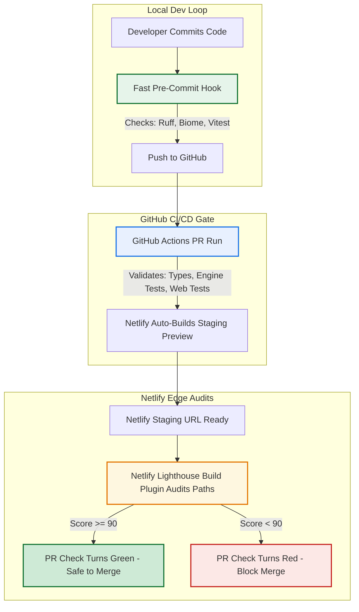

# Performance Auditing Strategy

Establish a high-fidelity, low-friction, cloud-native performance auditing pipeline to protect the application's user experience without dragging down developer velocity.

## Context & Vision

Web performance is a critical factor for trading dashboards and high-interactivity applications. Historically, developers audited performance via local headless browser passes (e.g. Husky pre-commit hooks), which introduced severe velocity bottlenecks and flaky false-positives due to local CPU and network resource variance.

To build a scalable engineering workflow, we offload heavy synthetic auditing to our hosting provider's cloud edge (**Netlify Deploy Previews**) while keeping local developer loops fast and lightweight.

---

## Comparison Matrix: Performance Auditing Strategies

| Strategy | Run Location | Velocity Impact (Developer Flow) | Score Accuracy & Flake Risk | Best Used For |
| :--- | :--- | :--- | :--- | :--- |
| **Pre-Commit Hook** | Local Machine | **High Drag** (+15–45s per commit unless highly optimized) | **Poor** (Extreme variance based on local background CPU tasking) | Small, fast static landing pages; catching layout shifts instantly before pushes. |
| **GitHub Actions (CI/CD)** | Ephemeral Cloud VM | **Low Drag** (Asynchronous; runs entirely in background) | **Moderate** (Noiser shared cloud hardware, but highly consistent rules) | Standard regression testing; blocking bad code merges on Pull Requests. |
| **Netlify Deploy Previews** | Production Edge CDN | **Zero Drag** (Triggered after a cloud build deployment finishes) | **Excellent** (Audits a real public server link; highly deterministic) | Comprehensive frontend testing; production-parity Core Web Vitals checks. |

---

## Unified Blueprint: Layered Quality Gates

Our pipeline layers validation checks contextually so they do not obstruct developer velocity:



---

## Technical Implementation

### Netlify Lighthouse Plugin Configuration

The pipeline leverages `@netlify/plugin-lighthouse` registered directly in [netlify.toml](file:///Users/cesarvega/Documents/p-code/llm-market-bench/apps/web/netlify.toml).

```toml
# NOTE: In the actual netlify.toml file, do NOT include spaces inside the double brackets.
# Use standard double-bracketed plugins and plugins.inputs.audits syntax. Spaces are shown here 
# solely to prevent wiki cross-reference linter false-positives.

[ [plugins] ]
  package = "@netlify/plugin-lighthouse"

  [plugins.inputs]
    fail_deploy_on_score_thresholds = true

  [plugins.inputs.thresholds]
    performance = 0.90
    accessibility = 0.90
    best-practices = 0.90
    seo = 0.90

  [ [plugins.inputs.audits] ]
    path = "/"

  [ [plugins.inputs.audits] ]
    path = "/how-it-works"

  [ [plugins.inputs.audits] ]
    path = "/portfolios"
```

### Key Mechanisms:
- **Build Failures**: When `fail_deploy_on_score_thresholds` is set to `true`, a drop below **90** on any target route in Performance, Accessibility, Best Practices, or SEO will cause the Netlify deployment step to fail. This automatically flags the associated status check in the GitHub Pull Request as red.
- **Audit Target Routes**: We audit our primary landing page (`/`), core informational page (`/how-it-works`), and main trading portfolio overview dashboard (`/portfolios`).

---

## Technical Mitigations & Best Practices

To safeguard performance and achieve high-fidelity Core Web Vitals, all frontend and backend database implementations must adhere to the following optimized engineering guidelines:

### 1. Eliminating SSR Hydration Mismatches (React Error #418)
Hydration failures occur when the initial HTML rendered on the server differs from the DOM generated by the client during initial hydration. This causes React to throw out the SSR markup, triggering a costly full-page layout reflow and rendering delay.

Date and time operations are one of the most common and volatile sources of hydration errors in Server-Side Rendered (SSR) applications:

*   **The Perils of "now" in SSR**:
    Never instantiate `new Date()`, `Date.now()`, or dynamic relative time calculations within React components during the render phase. Because there is a natural time delta between the moment the server compiles the HTML and the moment the client hydrates the DOM, evaluating "now" dynamically on both sides guarantees a values mismatch. A difference of even a single millisecond or second in conditional rendering paths (e.g. active states) will trigger React Error #418.
    
*   **The ICU Whitespace Formatting Mismatch Peril**:
    Different Javascript environments implement ICU standards differently when formatting dates and times with `.toLocaleTimeString()` or `.toLocaleDateString()` under the `en-US` locale:
    * **Node.js (Server)**: Formats times using a standard space character (`U+0020`, char code `32`) before `AM`/`PM` (e.g., `10:45 AM`).
    * **Modern Browser (Client)**: Formats times using a **Narrow Non-Breaking Space** (`U+202F`, char code `8239`) before `AM`/`PM` (e.g., `10:45 AM`).
    * This hidden whitespace mismatch triggers instant, silent hydration failures of text nodes. To prevent this, formatters must explicitly normalize all whitespace characters: `str.replace(/\s+/g, ' ')`.

*   **The "Zero-Date" Frontend Architecture (Standard Mitigation)**:
    The most robust pattern is to **completely excise all temporal logic, time zone offsets, and date calculations from frontend components**.
    Instead, perform all date formatting, status calculations (e.g. checking if the market is open, or if data is stale), and time calculations **on the server inside the data loaders/API endpoints**. Pass these down in the JSON payload as simple, static pre-computed strings and booleans:
    * `todayDateString: string` (e.g., `"Saturday, May 30, 2026"`)
    * `isMarketOpen: boolean`
    * `isSentimentStale: boolean`
    The frontend component then renders these properties directly without executing any date parses or timezone-dependent logic, rendering the view layer 100% immune to time-related hydration errors.

*   **Symmetric Server-Client Reference Times (Fallback)**:
    If a component absolutely requires a runtime Date object for local calculations, capture a static `serverTime` inside the server's API payload. Fall back to this server-provided timestamp rather than calling `new Date()` to guarantee both the server HTML and hydrated client DOM evaluate the exact same reference moment.

*   **Avoid Client-Only Mounting Gates (`useEffect` / `mounted` states)**:
    Do not use `useEffect` mount gates (rendering empty/loading layouts on the server and only showing content after mounting) to solve timezone mismatches. Doing so causes visible layout shifts (CLS), delays page interactivity, and introduces unnecessary code complexity. Adhere instead to the "Zero-Date" Frontend Architecture.

### 2. Slashing Initial Server Response Times (TTFB)
Initial server response times depend directly on the database queries executed during the loading stage.
*   **Rolling Lookback Filters**: When querying massive chronological data tables (such as `price_history` for rolling calculations), always enforce a strict lookback date range filter at the database layer (e.g., `.gte('fetched_at', lookbackDate.toISOString())` restricted to the last 45 days). Never fetch the entire historical database table only to filter rows in memory.
*   **Segmented Parallel Queries to Avoid Truncation**: PostgREST/Supabase enforces a default maximum result limit of `1,000` rows. A single combined `.in()` query across many tickers over a long historical range can easily hit this threshold, resulting in truncated data and incorrect downstream calculations. Instead, execute segmented per-ticker queries in parallel (e.g., via `Promise.all` with a `.limit(N)` constraint). This guarantees untruncated chronological history for every ticker while reducing the overall row density fetched over the network, drastically slashing TTFB and database overhead.
*   **Excising Unused High-Volume Queries**: Avoid loading high-volume or heavy tables (such as raw `llm_reasoning_logs` conversation trees containing massive text columns) in primary landing page queries if they are only rendered on secondary pages. Removing unused table loads cuts database scan times by hundreds of milliseconds and completely eliminates high-volume network overhead.

---

## Developer Guide

### Manual Whole-Site Audits (Unlighthouse)
To check performance, Core Web Vitals, accessibility, and SEO across the entire sitemap locally without waiting for CI/CD deployments:

```bash
# Run a quick, zero-install audit against a production or preview URL
npx unlighthouse --site https://benchify.netlify.app/
```
Unlighthouse will automatically crawl the sitemap, run Lighthouse in parallel across discovered routes, and launch a local visual dashboard at `http://localhost:5678/` detailing specific opportunities.

### Mitigating Failures & Regression Debugging
If a deploy check fails because of a score drop:
1. Open the failed check logs on Netlify or the markdown table posted in the GitHub PR comments.
2. Locate which route failed (e.g. `/portfolios`) and which category dropped.
3. Boot your local dev environment (`pnpm dev:web`) and run Chrome DevTools Lighthouse or PageSpeed Insights on your preview server.
4. Check for common regression culprits:
   - Accidental large image imports without sizing constraints.
   - Dynamic imports / code splitting failures (overly large chunk sizes).
   - Missing Alt attributes or aria-labels (accessibility drops).
   - Core Web Vitals issues such as Cumulative Layout Shifts (`CLS`) or Largest Contentful Paint (`LCP`) regressions.

### TDD Zero-Load Regression Testing
To guarantee that high-volume tables (e.g., raw reasoning conversation logs) are never fetched on performance-critical pages (like the homepage loader) and prevent performance regressions during future refactors, write a module-level mock unit test that asserts:
1.  The specific heavy table is **never queried** by the Supabase client (e.g., spy on the client `.from` call and assert `not.toHaveBeenCalledWith('heavy_table')`).
2.  The returned payload does **not contain** the heavy data keys.

Example test block (as implemented in `fetch-today-data.test.ts`):
```typescript
describe('fetchTodayData zero-load TDD checks', () => {
    it('does not load reasoning logs and does not return them', async () => {
        const fromSpy = vi.fn().mockImplementation(() => ({
            select: vi.fn().mockReturnThis(),
            limit: vi.fn().mockImplementation(() => Promise.resolve({ data: [] })),
            // ...
        }));
        mockSupabaseClient = { from: fromSpy };
        const result = await fetchTodayData();
        expect(fromSpy).not.toHaveBeenCalledWith('llm_reasoning_logs');
        expect(result).not.toHaveProperty('logs');
    });
});
```

### TDD Hydration Regression Testing
To guarantee that pages render symmetrically between server-side generation (SSR) and client-side hydration without needing heavy E2E tests, write unit tests leveraging our unified hydration test helper:

1. **Test Helper**: [assertHydrationSymmetry](file:///Users/cesarvega/Documents/p-code/llm-market-bench/apps/web/src/test/hydration-test-helper.tsx) simulates the edge SSR step via `ReactDOMServer.renderToString()` and client-side hydration via `hydrateRoot()` in JSDOM. It registers a global event listener to intercept React 19's asynchronous scheduler mismatch exceptions, returning a list of caught errors.
2. **Regression Suite**: Add test cases to [hydration.test.tsx](file:///Users/cesarvega/Documents/p-code/llm-market-bench/apps/web/src/test/hydration.test.tsx) wrapping your components inside necessary providers (e.g. `QueryClientProvider`).
3. **Execution**: Runs automatically as part of the `pnpm test` script triggered by Husky before every local git commit.

Example hydration check block:
```typescript
import { assertHydrationSymmetry } from '~/test/hydration-test-helper';
import { MarketStatusHero } from './MarketStatusHero';

describe('MarketStatusHero Hydration Check', () => {
    it('hydrates flawlessly with symmetric data', () => {
        const errors = assertHydrationSymmetry(<MarketStatusHero data={mockData} />);
        expect(errors).toEqual([]);
    });
});
```

### Bypassing in Emergencies

If a deployment is absolutely critical and blocked by a minor score variance or an external API delay, you can disable the build plugin checks temporarily by modifying `netlify.toml` directly or setting a custom Netlify environment variable, though this should be avoided to preserve main-branch stability.

## Related

- [[entities/web-app]]
- [[sources/web-deployment-source]]
