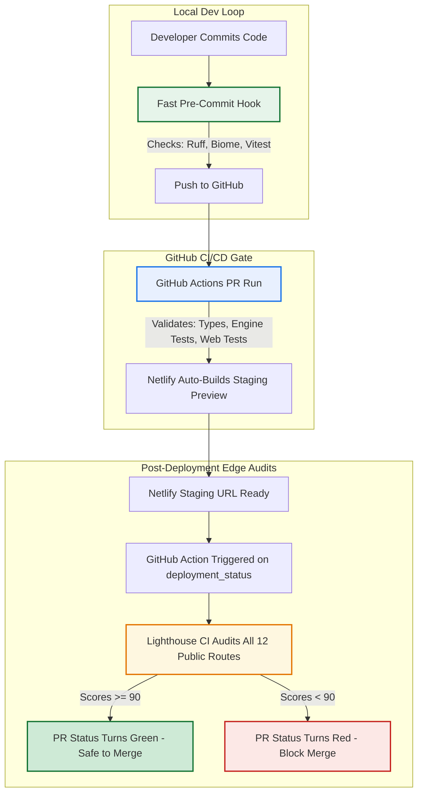

# Performance Auditing Strategy

Establish a high-fidelity, low-friction, cloud-native performance auditing pipeline to protect the application's user experience without dragging down developer velocity.

## Context & Vision

Web performance is a critical factor for trading dashboards and high-interactivity applications. Historically, developers audited performance via local headless browser passes (e.g. Husky pre-commit hooks), which introduced severe velocity bottlenecks and flaky false-positives due to local CPU and network resource variance.

To build a scalable engineering workflow, we offload heavy synthetic auditing to our hosting provider's cloud edge (**Netlify Deploy Previews**) while keeping local developer loops fast and lightweight.

---

## Comparison Matrix: Performance Auditing Strategies

| Strategy | Run Location | Velocity Impact (Developer Flow) | Score Accuracy & Flake Risk | Best Used For |
| :--- | :--- | :--- | :--- | :--- |
| **Pre-Commit Hook** | Local Machine | **High Drag** (+15–45s per commit unless highly optimized) | **Poor** (Extreme variance based on local background CPU tasking) | Small, fast static landing pages; catching layout shifts instantly before pushes. |
| **Netlify Build Plugin** | Staged Build Container | **Moderate Drag** (Fails build on compile phase) | **Incompatible with SSR** (Cannot audit serverless/dynamic routes since serverless functions aren't running yet) | Purely static generated sites with no serverless functions. |
| **Post-Deployment CI/CD** | Production Edge CDN | **Zero Drag** (Runs asynchronously in GitHub Actions after deployment succeeds) | **Excellent** (Audits real live serverless endpoints; highly deterministic) | SSR/serverless frameworks (TanStack Start, Next.js); full production-parity audits. |

---

## Unified Blueprint: Layered Quality Gates

Our pipeline layers validation checks contextually so they do not obstruct developer velocity:



---

## Technical Implementation

### Post-Deployment Lighthouse CI Workflow

The pipeline utilizes `@lhci/cli` triggered automatically on deployment successes in [.github/workflows/lighthouse.yml](file:///Users/cesarvega/Documents/p-code/llm-market-bench/.github/workflows/lighthouse.yml). Threshold budgets are managed dynamically inside [lighthouserc.json](file:///Users/cesarvega/Documents/p-code/llm-market-bench/lighthouserc.json).

#### lighthouserc.json Configuration:
```json
{
  "ci": {
    "collect": {
      "numberOfRuns": 1,
      "settings": {
        "chromeFlags": "--no-sandbox --headless --disable-gpu"
      }
    },
    "assert": {
      "assertions": {
        "categories:performance": ["error", { "minScore": 0.9 }],
        "categories:accessibility": ["error", { "minScore": 0.9 }],
        "categories:best-practices": ["error", { "minScore": 0.9 }],
        "categories:seo": ["error", { "minScore": 0.9 }]
      }
    }
  }
}
```

### Key Mechanisms:
- **Deployment Status Trigger**: The workflow listens to the `deployment_status` event and launches as soon as Netlify marks a deploy state as `success`.
- **Comprehensive Public Audits**: We audit all 12 public routes dynamically against the live deployment target URL:
  - `/` (Root homepage)
  - `/how-it-works` (How it works timeline)
  - `/portfolios` (Trading portfolios dashboard)
  - `/audits` (System status verification logs)
  - `/autoresearch` (Auto-research arena)
  - `/cause-and-effect` (Consensus cause-and-effect charts)
  - `/concepts` (D3 concept relationship map)
  - `/market-overview` (Market sentiment and trends)
  - `/memories` (Consensus memory flow timeline)
  - `/reasoning` (LLM reasoning log explorer)
  - `/login` (User login page)
  - `/signup` (User signup page)
- **Score Assertion Gate**: The pipeline automatically asserts budgets of `0.90` (90%) for Performance, Accessibility, Best Practices, and SEO across all audited pages, blocking merges on budget violations.

---

## Technical Mitigations & Best Practices

To safeguard performance and achieve high-fidelity Core Web Vitals, all frontend and backend database implementations must adhere to the following optimized engineering guidelines:

### 1. Eliminating SSR Hydration Mismatches (React Error #418)

Hydration failures occur when the initial HTML rendered on the server differs from the DOM generated by the client during initial hydration. This causes React to throw out the SSR markup, triggering a costly full-page layout reflow and rendering delay.

Date and time operations are the most common and volatile source of hydration errors in Server-Side Rendered (SSR) applications. To resolve these, we adhere strictly to the **5 Core Client/Server Time Best Practices**:

#### Rule 1: The "Zero-Date" Frontend Architecture (Primary Standard)
Completely excise all temporal logic, time zone offsets, and date calculations from frontend components.
Instead, perform all date formatting, status calculations (e.g., checking if the market is open or sentiment is stale), and time formatting **on the server inside the data loaders or server functions**. Pass these down in the JSON payload as simple, static, pre-computed strings and booleans (e.g., `formattedTime: "10:45 AM ET"` or `todayDateString: "Saturday, May 30, 2026"`). Frontend components must render these properties directly without executing any Date parses or timezone-dependent logic, making the view layer 100% immune to time-related hydration errors.

#### Rule 2: Never Instantiate "now" in the Render Phase
Never call `new Date()`, `Date.now()`, or dynamic relative time calculations within React components during the render phase. Because there is a natural time delta between the moment the server compiles the HTML and the moment the client hydrates the DOM, evaluating "now" dynamically on both sides guarantees a values mismatch. A difference of even a single millisecond or second in conditional rendering paths will trigger React Error #418. 

#### Rule 3: Explicitly Normalize ICU Whitespace Characters
Different Javascript environments implement ICU standards differently when formatting dates and times with `.toLocaleTimeString()` or `.toLocaleDateString()` under the `en-US` locale:
*   **Node.js (Server)**: Formats times using a standard space character (`U+0020`, char code `32`) before `AM`/`PM` (e.g., `10:45 AM`).
*   **Modern Browser (Client)**: Formats times using a **Narrow Non-Breaking Space** (`U+202F`, char code `8239`) before `AM`/`PM` (e.g., `10:45 AM`).
To prevent this hidden whitespace mismatch from triggering instant text node hydration failures, formatters must explicitly normalize all whitespace characters using our utility: `str.replace(/\s+/g, ' ')`. Any component rendering dates/times dynamically on the client side must wrap the output in `normalizeWhitespace` (imported from `~/utils/date`) to scrub narrow non-breaking spaces and ensure absolute server-client consistency.

#### Rule 4: Enforce Explicit Timezones for Formatter Output
If a component requires formatting a date/time on the client side, never rely on the local system timezone. Always lock the formatting function to a strict, hardcoded timezone (e.g., `America/New_York` for all market feeds):
```typescript
date.toLocaleDateString('en-US', {
    timeZone: 'America/New_York',
    month: 'short',
    day: 'numeric'
})
```
*Note:* Lock timezones carefully. Parsing timezone-naive date strings (like `"2026-06-15T00:00:00"`) will still shift the calendar day if the server parses in UTC and the client in a local zone. The only absolute mitigation is pre-formatting on the server (Rule 1).

#### Rule 5: Symmetric Server-Client Reference Times & Avoid Client-Only Mount Gates
*   **Symmetric Reference Times (Fallback)**: If a component absolutely requires a runtime Date object for local calculations, capture a static `serverTime` inside the server's API payload. Fall back to this server-provided timestamp rather than calling `new Date()` to guarantee both the server HTML and hydrated client DOM evaluate the exact same reference moment.
*   **Avoid Client-Only Mounting Gates (`useEffect` / `mounted` states)**: Do not use `useEffect` mount gates (rendering empty/loading layouts on the server and only showing content after mounting) to solve timezone mismatches. Doing so causes visible layout shifts (CLS), delays page interactivity, and introduces unnecessary code complexity. Adhere instead to the "Zero-Date" Frontend Architecture.

### 2. Slashing Initial Server Response Times (TTFB)
Initial server response times depend directly on the database queries executed during the loading stage.
*   **Rolling Lookback Filters**: When querying massive chronological data tables (such as `price_history` for rolling calculations), always enforce a strict lookback date range filter at the database layer (e.g., `.gte('fetched_at', lookbackDate.toISOString())` restricted to the last 45 days). Never fetch the entire historical database table only to filter rows in memory.
*   **Consolidated Single-Query Fetching to Avoid Edge Latency**: Spawning multiple parallel database requests (e.g., 23 separate queries) inside serverless edge functions saturates connection pools and drives up TTFB. Instead, consolidate these fetches into a single network query using `.in('ticker', TICKERS_LIST)` with an explicit `.limit(5000)` constraint to prevent PostgREST's default 1000-row limit truncation. The final grouping, calendar alignment, and 30-day capping are performed extremely quickly in-memory via helper functions (`buildHistoryGroup`), reducing database round-trips to 1 and slashing TTFB by 700ms+.
*   **Excising Unused High-Volume Queries**: Avoid loading high-volume or heavy tables (such as raw `llm_reasoning_logs` conversation trees containing massive text columns) in primary landing page queries if they are only rendered on secondary pages. Removing unused table loads cuts database scan times by hundreds of milliseconds and completely eliminates high-volume network overhead.
*   **Server-Side Dedup RPCs (preferred over client-side `.limit(N)`)**: When the frontend needs "the most-recent N rows per group" semantics (e.g., one row per ticker per calendar day), implement a SQL function (e.g., `latest_per_ticker_per_day(p_tickers TEXT[], p_days INT)` using `DISTINCT ON (ticker, date)`) and call it via `supabase.rpc(...)`. This returns a tiny, pre-deduped payload (≈50 rows for 23 tickers × 45 days) instead of transferring 5000+ raw rows that the JS client would have to scan, sort, and dedupe. Reduces SSR HTML document size and the 9-query parallel saturation that drives TTFB.
*   **Split Loaders for Split Critical Paths**: When a route has one piece of data that must paint fast (the LCP/hero block) and a second piece that can stream in below it, run two server functions in parallel via `Promise.all([getHero(), getFull()])` inside the route `loader`. The hero is one Supabase query (e.g. `market_feeling` + ET date math), the full payload is the rest. Each has its own 60 s in-memory cache keyed on the ET date string so warm function instances pay nothing for repeat hits within the window. See [[concepts/hero-loader-split]] for the full pattern.

### 3. Progressive Hydration & Code Splitting (LCP & TTI Optimization)
Heavy visualization libraries (like `d3` or `recharts`) and long component trees can inflate the initial JS bundle, blocking the main thread and severely degrading Time To Interactive (TTI).
*   **Suspense Boundaries**: Wrap secondary dashboard modules (e.g. historical timelines, deep analytics panels, or below-the-fold charts) in `React.lazy()` imports and `<Suspense>` boundaries.
*   **Priority Rendering**: The initial SSR payload should contain the fully-rendered critical Hero section (for instant First Contentful Paint) while the heavier components stream in progressively. This ensures the app becomes instantly responsive even on slow connections.

### 4. Eliminating Render-Blocking Resources
*   **Asynchronous Font Loading**: External stylesheets (like Google Fonts) should never be loaded synchronously in the `<head>` using a standard `rel="stylesheet"`. Instead, use the `media="print" onLoad="this.media='all'"` pattern with a `<noscript>` fallback. This allows the browser to download the assets without blocking the critical rendering path, significantly improving First Contentful Paint (FCP).
*   **Third-Party Script Optimization**: Third-party analytics and tracking SDKs (e.g., PostHog) can drastically inflate the initial JavaScript bundle with unused feature modules (such as `surveys.js`). Always configure SDK providers (like `<PostHogProvider>`) to explicitly disable unused features (e.g., `disable_surveys: true`). This prevents the browser from downloading and parsing wasted bytes, protecting the main thread and improving Time To Interactive (TTI).
*   **CSS Preload + Non-Blocking Stylesheet Pair**: Beyond fonts, your **own** bundled CSS file (`app.css`) can dominate FCP if it is the only render-blocking link in the head. The browser cannot paint anything until that stylesheet finishes parsing. The cure is a paired link strategy in `getRootHead()`: a `<link rel="preload" as="style" href={appCss}>` so the browser fetches the file in parallel with the JS chunk, paired with `<link rel="stylesheet" href={appCss} media="print" />` that flips `media` to `all` on `onLoad`. Net effect: the stylesheet is downloaded and applied without ever blocking the critical rendering path, and FCP is no longer gated on its parse.
*   **Drop Static `import` From Packages That Transitively Pull Heavy Runtimes**: A common gotcha with React SDK wrappers is that they themselves statically `import` the heavy runtime. For example, `@posthog/react` has `import posthogJs from 'posthog-js'` baked into its source, so any `import { usePostHog } from '@posthog/react'` in your code is enough to pull 30+ KiB of `posthog-js` into your main bundle. The fix is to bypass the wrapper entirely: implement your own thin React context (`PostHogContext`), expose a `useAnalytics()` hook that returns a noop until the real client is in scope, and dynamic-import the heavy runtime inside an idle callback. See [[concepts/posthog-stealth-proxy]] for the full implementation.

### 5. Skipping Auth & User-Scoped Work on Public Routes
SSR is expensive: every `supabase.auth.getUser()` call inside a `beforeLoad` runs against the Supabase API on every page load, even for fully public, anonymous-friendly pages. A 0.82 homepage Lighthouse score with 733 ms TTFB is partly a function of unnecessary auth work in the SSR path.
*   **Move auth checks to the protected subtree**: Run the auth check inside the `_authed.tsx` layout's `beforeLoad` (or per-route server fn), not in `__root.tsx`. Public pages then render without any Supabase call.
*   **Client-only user hydration**: For nav elements that want the current user, expose a `useCurrentUser` hook whose `useQuery` is `enabled: false` on SSR and whose server fn only runs on client navigation. The hook returns a noop (or `{ isLoading: true }`) during SSR so the public homepage never sees a Supabase auth round-trip.
*   **Same applies to `posthog.identify(...)`**: never call it server-side during SSR; only after a login mutation succeeds on the client.

### 6. Accessibility & Color Contrast
Lighthouse includes accessibility in its ≥0.90 budget. A common silent failure is a "stale" or "warning" badge that uses `text-amber-300` on a `bg-amber-500/20` glass surface — the contrast ratio fails WCAG AA (4.5:1). Audit every colored badge/pill on dark glass surfaces with a contrast checker before shipping; prefer `text-amber-100` (lighter, higher contrast) over `text-amber-300` when the background has any opacity overlay.

### 7. CDN Cache Headers for Public SSR
A homepage rendered by an SSR function still benefits from aggressive CDN caching because the response is identical for every anonymous visitor. Add `Cache-Control: public, s-maxage=60, stale-while-revalidate=300` for `/`, `max-age=31536000, immutable` for `/assets/*` (hashed filenames), and `private, no-store` for any `/_authed/*` path. Netlify, Cloudflare, and Fastly all honor these. The `s-maxage=60` window absorbs bot/curl traffic and re-fires in well under the Lighthouse audit window, dramatically cutting TTFB and document load time on repeat visits.

### 8. Gate Devtools to DEV Bundles Only
`@tanstack/react-router-devtools` (and other "dev-only" packages) ship sizeable UI code that you absolutely do not want in production. Two patterns to enforce:
*   **Lazy import with a prod short-circuit**: `const TanStackRouterDevtools = lazy(() => import.meta.env.PROD ? Promise.resolve({ default: () => null }) : import('@tanstack/react-router-devtools').then(m => ({ default: m.TanStackRouterDevtools })))` — the dynamic import never fires in prod, so the package is not bundled.
*   **JSX gate**: `{import.meta.env.DEV && <Suspense><TanStackRouterDevtools position="bottom-right" /></Suspense>}` — even if the import leaked, the JSX is dead-code-eliminated. Both together is the strongest guarantee.

---

## Developer Guide

### Manual Whole-Site Audits (Unlighthouse)
To check performance, Core Web Vitals, accessibility, and SEO across the entire sitemap locally without waiting for CI/CD deployments:

```bash
# Run a quick, zero-install audit against a production or preview URL
npx unlighthouse --site https://benchify.netlify.app/
```
Unlighthouse will automatically crawl the sitemap, run Lighthouse in parallel across discovered routes, and launch a local visual dashboard at `http://localhost:5678/` detailing specific opportunities.

### Mitigating Failures & Regression Debugging
If a deploy check fails because of a score drop:
1. Open the failed check logs on Netlify or the markdown table posted in the GitHub PR comments.
2. Locate which route failed (e.g. `/portfolios`) and which category dropped.
3. Boot your local dev environment (`pnpm dev:web`) and run Chrome DevTools Lighthouse or PageSpeed Insights on your preview server.
4. Check for common regression culprits:
   - Accidental large image imports without sizing constraints.
   - Dynamic imports / code splitting failures (overly large chunk sizes).
   - Missing Alt attributes or aria-labels (accessibility drops).
   - Core Web Vitals issues such as Cumulative Layout Shifts (`CLS`) or Largest Contentful Paint (`LCP`) regressions.

### TDD Zero-Load Regression Testing
To guarantee that high-volume tables (e.g., raw reasoning conversation logs) are never fetched on performance-critical pages (like the homepage loader) and prevent performance regressions during future refactors, write a module-level mock unit test that asserts:
1.  The specific heavy table is **never queried** by the Supabase client (e.g., spy on the client `.from` call and assert `not.toHaveBeenCalledWith('heavy_table')`).
2.  The returned payload does **not contain** the heavy data keys.

Example test block (as implemented in `fetch-today-data.test.ts`):
```typescript
describe('fetchTodayData zero-load TDD checks', () => {
    it('does not load reasoning logs and does not return them', async () => {
        const fromSpy = vi.fn().mockImplementation(() => ({
            select: vi.fn().mockReturnThis(),
            limit: vi.fn().mockImplementation(() => Promise.resolve({ data: [] })),
            // ...
        }));
        mockSupabaseClient = { from: fromSpy };
        const result = await fetchTodayData();
        expect(fromSpy).not.toHaveBeenCalledWith('llm_reasoning_logs');
        expect(result).not.toHaveProperty('logs');
    });
});
```

### TDD Hydration Regression Testing
To guarantee that pages render symmetrically between server-side generation (SSR) and client-side hydration without needing heavy E2E tests, write unit tests leveraging our unified hydration test helper:

1. **Test Helper**: [assertHydrationSymmetry](file:///Users/cesarvega/Documents/p-code/llm-market-bench/apps/web/src/test/hydration-test-helper.tsx) simulates the edge SSR step via `ReactDOMServer.renderToString()` and client-side hydration via `hydrateRoot()` in JSDOM. It registers a global event listener to intercept React 19's asynchronous scheduler mismatch exceptions, returning a list of caught errors.
2. **Regression Suite**: Add test cases to [hydration.test.tsx](file:///Users/cesarvega/Documents/p-code/llm-market-bench/apps/web/src/test/hydration.test.tsx) wrapping your components inside necessary providers (e.g. `QueryClientProvider`).
3. **Execution**: Runs automatically as part of the `pnpm test` script triggered by Husky before every local git commit.

Example hydration check block:
```typescript
import { assertHydrationSymmetry } from '~/test/hydration-test-helper';
import { MarketStatusHero } from './MarketStatusHero';

describe('MarketStatusHero Hydration Check', () => {
    it('hydrates flawlessly with symmetric data', () => {
        const errors = assertHydrationSymmetry(<MarketStatusHero data={mockData} />);
        expect(errors).toEqual([]);
    });
});
```

#### ICU Space Simulation Testing
To guarantee date formatters do not leak unnormalized narrow non-breaking spaces, our test runner runs in JSDOM where both SSR and hydration normally execute under Node.js's same standard whitespace formatting environment.
To address this testing blindspot, [hydration.test.tsx](file:///Users/cesarvega/Documents/p-code/llm-market-bench/apps/web/src/test/hydration.test.tsx) implements an **ICU Space Simulation Test**. It spies on `ReactDOMServer.renderToString` and `Date.prototype.toLocaleDateString` to dynamically replace all standard spaces with browser-specific narrow non-breaking spaces (`\u202f`) during client hydration, asserting that components like `FutureCatalysts` hydrate flawlessly under browser-like whitespace deltas.


### Bypassing in Emergencies

If a deployment is absolutely critical and blocked by a minor score variance or an external API delay, you can disable the build plugin checks temporarily by modifying `netlify.toml` directly or setting a custom Netlify environment variable, though this should be avoided to preserve main-branch stability.

## Related

- [[entities/web-app]]
- [[concepts/posthog-stealth-proxy]] — same-origin analytics + lazy posthog-js bundling
- [[concepts/hero-loader-split]] — split loader pattern for fast LCP
- [[entities/macro-tracker]] — 23-ticker macro regime and `latest_per_ticker_per_day` RPC
- [[sources/web-deployment-source]] — Netlify edge cache headers and stealth proxy
