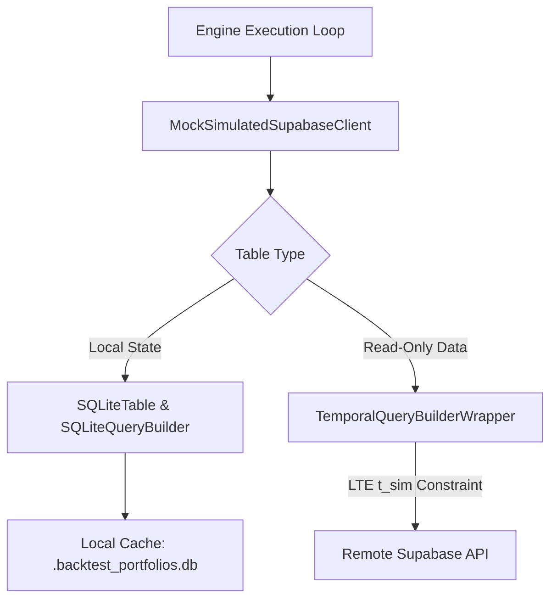

# Temporal Sandboxing & Backtesting Simulation

The temporal database sandboxing system enables full walk-forward simulation of model portfolios (e.g., Gemini, DeepSeek, MiniMax) without modifying historical database state, colliding with live execution environments, or leaking future data.

## Architecture

During backtest simulation, the engine executes sequential ticks simulating historical points in time ($t_{\text{sim}}$). To isolate database access, all queries to the database are wrapped in a simulated Point-in-Time database client.

### 1. Dynamic Namespace Attribute Patching
Standard module-level mock patches fail when target files import functions (like `get_supabase_client`) at import time using `from core.db import get_supabase_client`. To prevent queries from bypassing the mock, `global_supabase_patch(mock_sync, mock_async)` dynamically inspects all modules loaded in `sys.modules` at runtime and overwrites the bindings to the mock client, ensuring complete, leakproof query redirection.

### 2. Unified SQLite Mock Query Builder
Local portfolio operations, trades ledging, and decision audits are redirected to a local SQLite database (`.backtest_portfolios.db`). The mock query builder (`SQLiteQueryBuilder`) provides a unified, chainable interface supporting `SELECT`, `UPDATE`, and `DELETE` actions, alongside standard postgrest-py operators:
* `.eq()`, `.neq()`, `.gt()`, `.gte()`, `.lt()`, `.lte()`, `.in_()`, `.match()`
* `.order()`, `.limit()`, and `.maybe_single()`
* Supports variable arguments inside `select(*args)` by joining inputs into a comma-separated select filter string.

### 3. Point-in-Time Data Sandboxing & Redirection
To ensure complete isolation of the simulated environment:
* **Redirection of Price Caching**: Large price cache tables (`price_history` and `market_data_cache`) are redirected to the local SQLite database. This eliminates network roundtrip times, prevents remote 504 Gateway Timeout errors, and shields production data.
* **Redirection of Performance Logs**: To prevent backtest runs from contaminating the production database performance history (which breaks frontend chart visualization), `portfolio_performance` daily snapshots are redirected to the local SQLite database.
* **Local `position_pnl` VIEW**: The portfolio ledger computes positions and unrealized PnL using the database. Since positions are local to the backtest run, `position_pnl` is recreated in SQLite as a local view. This view dynamically joins `portfolios`, `portfolio_positions`, and the local `market_data_cache`, ensuring that LLM verifiers evaluate compliance using correct point-in-time mock portfolios.
* **Simulated `"now()"` Time Substitution**: Simulated mock writes (`SQLiteInsertBuilder`) substitute Postgres server-side `"now()"` literals with the exact ISO-formatted simulated date-time ($t_{\text{sim}}$). This enables correct calculations of trade age relative to the simulation clock.
* **Equity-Based Return Calculations**: Weekly backtest evaluation calculates returns using `total_equity` (which incorporates the current value of held positions) rather than `cash_balance` (which was negative due to margin loans). This correctly aligns simulated performance with the actual growth of the accounts.

### 4. Live Account Mirror Prevention
Backtesting executes mock trades using actual simulated pricing. To prevent these trades from being mirrored to the live third-party broker (Alpaca paper endpoint), the execution is configured with `skip_alpaca_mirror=True`. This prevents API authentication or buying power errors and guarantees that backtest runs are entirely mock-only.

## Related

- [[entities/autoresearch]] — Karpathy-style autonomous prompt improvement loop
- [[concepts/execution]] — Pre-market validation, Reg T checks, trade settlement
- [[sources/reg-t-calculations-source]] — Margin account formulas & guardrails
