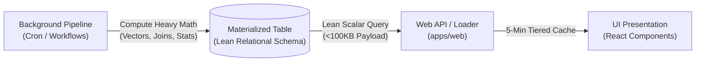

# Zero Compute on Frontend

The web application (`apps/web`) is strictly a presentation and interaction layer. It must never perform heavy data transformations, mathematical modeling, statistical correlations, multi-table joins, ranking algorithms, or raw dataset filtering. All derived intelligence, metrics, and cross-domain correlations must be pre-calculated and materialized into lean relational tables during background engine pipelines.

---

## Why Heavy Compute on Web Fails

Attempting Just-In-Time (JIT) calculations on user read paths or inside server loaders introduces critical architectural failure modes:

1. **Serialization Overhead (The 6MB Problem)**:
   High-dimensional data (such as 768-dimensional float vectors or raw event payloads) serializes into massive text JSON over HTTP/PostgREST (~6 KB per vector row). Fetching 1,000 vectors transfers ~6 MB of raw text across the wire on every single request, purely to compute basic dot products in a Node server function.
2. **Edge Execution Timeouts**:
   Serverless functions and edge loaders have strict execution budgets (typically 5 to 10 seconds). In-memory joins or linear scans across thousands of records degrade Time to First Byte (TTFB) and risk edge worker timeouts.
3. **Database Concurrency Degradation**:
   When multiple users access a page simultaneously, redundant JIT queries force the database to repeatedly transfer and scan identical source datasets instead of serving pre-indexed, scalar lookups.
4. **Cache Invalidation Complexity**:
   Caching the output of complex ad-hoc calculations in Node memory across distributed serverless instances is brittle and leads to stale or out-of-sync states between users.

---

## The Pre-Computed Materialization Pattern

All derived cross-domain intelligence follows a deterministic 3-stage lifecycle:

1. **Pipeline Execution**: Background scheduled jobs ([.github/workflows/*.yml](file:///home/cv/Documents/Code/llm-market-bench/.github/workflows), [apps/engine/main.py](file:///home/cv/Documents/Code/llm-market-bench/apps/engine/main.py)) compute heavy mathematical models, embeddings, or cross-domain collisions offline.
2. **Relational Materialization**: Results are written to dedicated Supabase tables (`catalyst_radar`, `market_barometer_history`, `earnings_alpha`) with targeted indexes, scalar columns, and tight row counts.
3. **Fast Presentation Read**: Web loaders query only scalar columns with strict pagination, returning clean payloads under 100 KB with synchronized tiered caching (Node RAM cache + TanStack Query `staleTime`).

---

## Reference Implementations

The project maintains three canonical implementations of this pattern:

| Feature | Upstream Compute Pipeline | Materialized Table | Web Read Path |
| :--- | :--- | :--- | :--- |
| **Catalyst Radar** (`"Keep an Eye"`) | Matches concept vectors against calendar event embeddings in `apps/engine/analysis/catalyst_radar.py` during `calendar.yml` and `main.py`. | `public.catalyst_radar` | `fetchConcepts` loads scalar catalyst records (`stage`, `similarity`, `target_date`) in parallel with concepts. |
| **Market Barometer** | Ingests 23 macro assets across 6 categories and computes historical z-scores and sentiment in `apps/engine/core/macro_tracker.py`. | `public.market_barometer_history` | `fetchMarketBarometer` loads pre-aggregated status and trend records. |
| **Earnings Alpha** | Calculates historical post-earnings drift and probability distributions in engine ingestion. | `public.earnings_alpha` | `fetchEarningsCalendar` reads pre-calculated alpha metrics directly. |

---

## Web Read Path Standards

All API fetchers in `apps/web/src/features/**/api/fetch-*.ts` must adhere to these rules:

1. **Never Select Raw Vectors**: Never include `concept_vector`, `embedding`, or large unindexed JSON blobs in `.select()` queries.
2. **Sub-100KB Payloads**: Enforce explicit pagination (`.range()` or `.limit()`) and scalar column lists.
3. **Synchronized Tiered Caching**: Pair in-memory server cache TTLs with matching client `staleTime` (e.g. 5 minutes) so background pipeline updates propagate smoothly without manual refreshes.
4. **Presentation Only**: Formatting is permitted (date normalization, color mapping, sorting displayed slices); mathematical modeling and multi-table joining are prohibited.

---

## Related

- [[concepts/rendering-strategies]]
- [[concepts/catalyst-radar]]
- [[entities/database]]
- [[entities/pipeline]]
- [[entities/web-app]]
